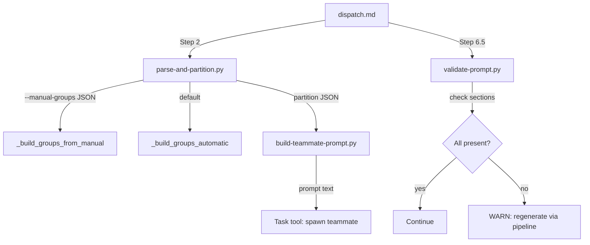

# Design: dispatch-guardrails

## Overview

Three components: (1) `--manual-groups` flag extending parse-and-partition.py's partition_tasks(), (2) new validate-prompt.py script checking teammate prompt sections, (3) Step 6.5 in dispatch.md invoking validation post-spawn. All deterministic Python/bash logic.

## Architecture

## Components

### Component A: Manual Groups (parse-and-partition.py)

**Purpose**: Accept `--manual-groups` JSON mapping group names to task ID lists, bypassing auto-partition while keeping the rest of the pipeline intact.

**Responsibilities**:
- Parse `--manual-groups` JSON string
- Validate all task IDs exist in parsed tasks
- Build groups with computed file ownership from constituent tasks
- Handle unassigned tasks as serial tasks
- Respect `--max-teammates` limit (truncate groups)

**Function**: `_build_groups_from_manual(manual_groups_json, all_tasks, parallel_tasks, max_teammates)`

**Integration point**: Called from `partition_tasks()` when `manual_groups` arg is not None, before checking predefined groups or auto-partition.

### Component B: Prompt Validator (validate-prompt.py)

**Purpose**: Verify teammate prompts contain required sections injected by build-teammate-prompt.py.

**Responsibilities**:
- Accept prompt text via `--prompt-file` or stdin
- Check for required section headers (regex matching)
- Return structured diagnostics (JSON or text)
- Exit code signaling (0 = pass, 1 = fail)

**Required sections** (from build-teammate-prompt.py output):

| Section | Regex Pattern | Why Required |
|---------|--------------|--------------|
| File Ownership | `## File Ownership` | Prevents cross-group writes |
| Quality Checks | `## Quality Checks` | Ensures build/test/lint run |
| Commit Convention | `## Commit Convention` | Signed-off-by provenance |
| Signed-off-by | `Signed-off-by:` | Commit trailer present |

### Component C: Dispatch Integration (dispatch.md)

**Purpose**: Wire validation into the dispatch flow as Step 6.5.

**Responsibilities**:
- After Step 6 (teammates spawned), validate each generated prompt
- Display warnings for missing sections
- Instruct lead to regenerate via build-teammate-prompt.py if validation fails

## Data Flow

1. Lead runs `/dispatch` with optional `--manual-groups '{"infra": ["1.1","1.2"], "api": ["1.3","1.4"]}'`
2. parse-and-partition.py receives `--manual-groups`, calls `_build_groups_from_manual()`
3. Function validates task IDs, computes file ownership, outputs partition JSON (same schema as auto-partition)
4. build-teammate-prompt.py generates prompts from partition JSON (unchanged)
5. dispatch.md spawns teammates with generated prompts
6. **Step 6.5**: dispatch.md pipes each prompt to validate-prompt.py
7. validate-prompt.py reports missing sections; lead decides whether to regenerate

## Technical Decisions

| Decision | Options | Choice | Rationale |
|----------|---------|--------|-----------|
| Manual groups input format | CLI JSON string vs. file | JSON string | Matches existing `--quality-commands` pattern in build-teammate-prompt.py |
| Group priority | manual > predefined > auto | manual > predefined > auto | Most specific override wins |
| File ownership for manual groups | User-supplied vs. computed | Computed from task files | Prevents human error; consistent with auto-partition |
| Validation strictness | Fail-closed vs. fail-open | Fail-open (warn only) | Teammates already spawned; killing them wastes resources |
| validate-prompt.py invocation | Hook vs. dispatch.md step | dispatch.md step | No PostToolUse hook exists for Task tool |

## File Structure

| File | Action | Purpose |
|------|--------|---------|
| `ralph-parallel/scripts/parse-and-partition.py` | Modify | Add `--manual-groups` flag + `_build_groups_from_manual()` |
| `ralph-parallel/scripts/validate-prompt.py` | Create | New script to validate teammate prompt sections |
| `ralph-parallel/commands/dispatch.md` | Modify | Add `--manual-groups` to arg parsing + Step 6.5 validation |
| `ralph-parallel/scripts/test_parse_and_partition.py` | Modify | Add tests for `--manual-groups` |
| `ralph-parallel/scripts/test_validate_prompt.py` | Create | Tests for validate-prompt.py |
| `ralph-parallel/scripts/test_build_teammate_prompt.py` | Modify | May need fixture updates if prompt format referenced |

## Error Handling

| Error | Handling | User Impact |
|-------|----------|-------------|
| Invalid JSON in `--manual-groups` | Exit 1 with parse error message | Lead fixes JSON and re-runs |
| Task ID in manual groups not found in tasks.md | Exit 1 listing unknown IDs | Lead checks task IDs |
| All tasks in manual groups already completed | Exit 2 (existing behavior) | "Nothing to dispatch" |
| validate-prompt.py finds missing sections | Exit 1 + WARNING to stderr | Lead regenerates prompt via pipeline |
| Manual group exceeds `--max-teammates` | Truncate groups, warn | Extra groups become serial |

## Existing Patterns to Follow

- **argparse flag pattern**: `parse-and-partition.py` main() uses `parser.add_argument('--strategy', ...)`. New `--manual-groups` follows same pattern.
- **Exit code convention**: 0=success, 1=error, 2=all-complete, 3=single-task, 4=circular. validate-prompt.py uses 0=pass, 1=fail.
- **Module loading for tests**: `importlib.util.spec_from_file_location()` pattern from `test_parse_and_partition.py`
- **JSON + text output modes**: validate-tasks-format.py has `--json` flag; validate-prompt.py follows same pattern.
- **Partition JSON schema**: Groups have `index`, `name`, `tasks`, `taskDetails`, `ownedFiles`, `dependencies`, `phases`, `hasMultiplePhases`. Manual groups must produce identical schema.
