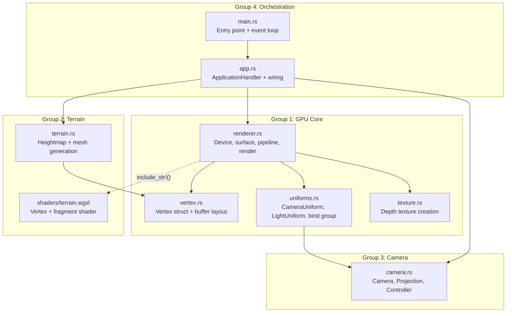
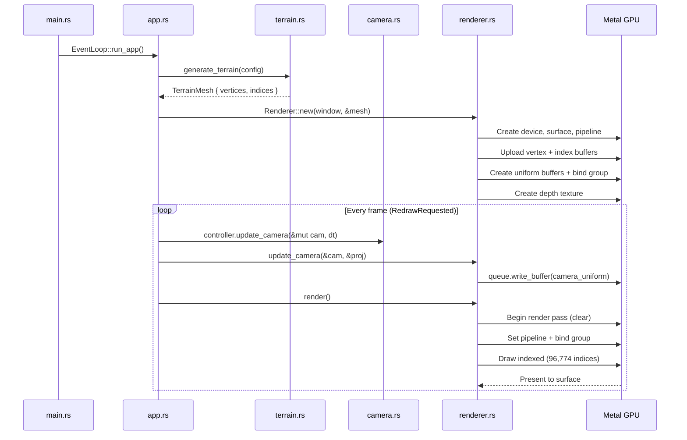
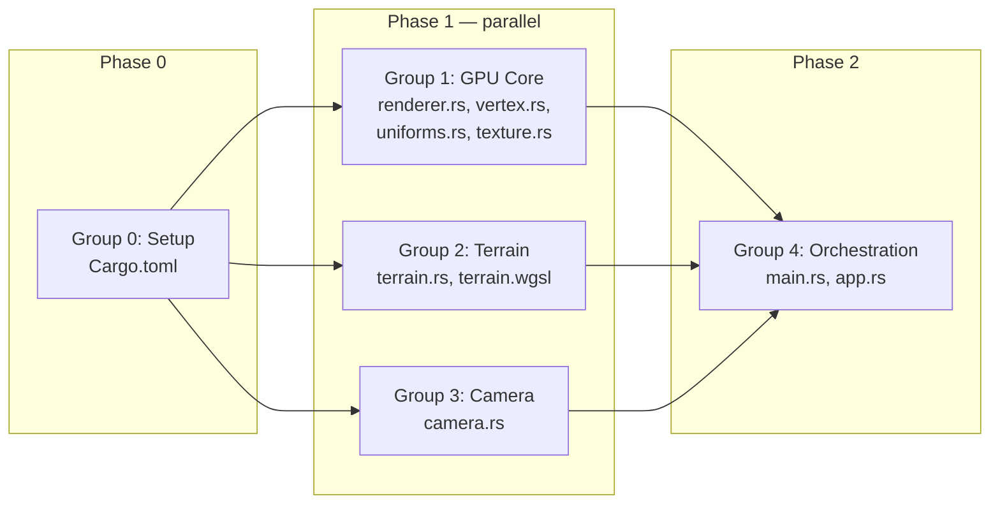

# Design: GPU Graphics Demo

## Overview

Native Rust wgpu terrain renderer targeting macOS Metal. A 128x128 vertex grid displaced by FBM noise, colored by height (green/brown/white), lit by a directional light, navigated with FPS camera (WASD + mouse). Architecture isolates `vertex.rs` as the shared type contract enabling Groups 1-3 to execute in parallel.

## Architecture



## Components

### 1. Vertex — `src/vertex.rs` (Group 1)

Shared type contract. Both `terrain.rs` (produces vertices) and `renderer.rs` (creates buffer layout) depend on this.

```rust
use bytemuck::{Pod, Zeroable};

#[repr(C)]
#[derive(Copy, Clone, Debug, Pod, Zeroable)]
pub struct Vertex {
    pub position: [f32; 3],
    pub normal: [f32; 3],
    pub color: [f32; 3],
}

impl Vertex {
    /// Returns the wgpu::VertexBufferLayout for this vertex type.
    /// Stride: 36 bytes (9 x f32).
    /// Attributes: position @0, normal @1, color @2.
    pub fn buffer_layout() -> wgpu::VertexBufferLayout<'static>;
}
```

**Vertex attribute layout:**

| Location | Field | Format | Offset |
|----------|-------|--------|--------|
| 0 | position | Float32x3 | 0 |
| 1 | normal | Float32x3 | 12 |
| 2 | color | Float32x3 | 24 |

Stride: 36 bytes.

---

### 2. Uniforms — `src/uniforms.rs` (Group 1)

GPU uniform buffers for camera view-projection and directional light.

```rust
use bytemuck::{Pod, Zeroable};

/// Camera uniform: 64 bytes (4x4 f32 matrix).
/// Bind group 0, binding 0.
#[repr(C)]
#[derive(Copy, Clone, Debug, Pod, Zeroable)]
pub struct CameraUniform {
    pub view_proj: [[f32; 4]; 4],
}

impl CameraUniform {
    pub fn new() -> Self;

    /// Update from Camera + Projection.
    /// Computes: projection * view matrix.
    pub fn update_view_proj(&mut self, camera: &camera::Camera, projection: &camera::Projection);
}

/// Light uniform: 32 bytes (padded for 16-byte alignment).
/// Bind group 0, binding 1.
#[repr(C)]
#[derive(Copy, Clone, Debug, Pod, Zeroable)]
pub struct LightUniform {
    /// Normalized direction vector. 4th component unused (padding).
    pub direction: [f32; 4],
    /// Light color RGB. 4th component unused (padding).
    pub color: [f32; 4],
}

impl LightUniform {
    /// Default: sun direction (-0.5, -1.0, -0.3) normalized, white light.
    pub fn new() -> Self;
}
```

**Bind group layout:**

| Binding | Type | Struct | Size |
|---------|------|--------|------|
| 0 | Uniform | CameraUniform | 64 bytes |
| 1 | Uniform | LightUniform | 32 bytes |

**Note on 16-byte alignment**: WGSL requires uniform struct members to align to 16 bytes. `direction` and `color` use `[f32; 4]` (vec4) instead of `[f32; 3]` (vec3). The 4th component is padding (set to 0.0). The WGSL shader reads only `.xyz`.

---

### 3. Texture — `src/texture.rs` (Group 1)

Depth buffer creation utility.

```rust
/// Create a depth texture for the given surface dimensions.
/// Format: Depth32Float. Usage: RENDER_ATTACHMENT | TEXTURE_BINDING.
/// Returns (Texture, TextureView).
pub fn create_depth_texture(
    device: &wgpu::Device,
    width: u32,
    height: u32,
    label: &str,
) -> (wgpu::Texture, wgpu::TextureView);

/// The depth texture format used throughout the app.
pub const DEPTH_FORMAT: wgpu::TextureFormat = wgpu::TextureFormat::Depth32Float;
```

---

### 4. Renderer — `src/renderer.rs` (Group 1)

GPU device initialization, render pipeline, and frame rendering. This is the largest component.

```rust
use std::sync::Arc;
use winit::window::Window;

pub struct Renderer<'a> {
    surface: wgpu::Surface<'a>,
    device: wgpu::Device,
    queue: wgpu::Queue,
    config: wgpu::SurfaceConfiguration,
    render_pipeline: wgpu::RenderPipeline,
    vertex_buffer: wgpu::Buffer,
    index_buffer: wgpu::Buffer,
    num_indices: u32,
    camera_uniform: CameraUniform,
    camera_buffer: wgpu::Buffer,
    light_uniform: LightUniform,
    light_buffer: wgpu::Buffer,
    uniform_bind_group: wgpu::BindGroup,
    depth_texture_view: wgpu::TextureView,
}

impl<'a> Renderer<'a> {
    /// Initialize wgpu: adapter, device, surface, pipeline, buffers.
    /// Loads terrain.wgsl via include_str!().
    /// Creates vertex/index buffers from TerrainMesh.
    /// Creates uniform buffers + bind group.
    /// Creates depth texture.
    pub async fn new(
        window: Arc<Window>,
        terrain_mesh: &terrain::TerrainMesh,
    ) -> Self;

    /// Handle window resize: reconfigure surface, recreate depth texture,
    /// update projection aspect ratio.
    pub fn resize(&mut self, new_size: winit::dpi::PhysicalSize<u32>);

    /// Update camera uniform buffer with new view-projection matrix.
    /// Called each frame before render().
    pub fn update_camera(
        &mut self,
        camera: &camera::Camera,
        projection: &camera::Projection,
    );

    /// Render one frame:
    /// 1. Get current surface texture
    /// 2. Create command encoder
    /// 3. Begin render pass (clear color + depth)
    /// 4. Set pipeline, bind group, vertex/index buffers
    /// 5. Draw indexed (num_indices)
    /// 6. Submit
    pub fn render(&mut self) -> Result<(), wgpu::SurfaceError>;

    /// Current surface size.
    pub fn size(&self) -> winit::dpi::PhysicalSize<u32>;
}
```

**Render pipeline configuration:**

| Setting | Value |
|---------|-------|
| Shader | `include_str!("../shaders/terrain.wgsl")` |
| Vertex entry | `vs_main` |
| Fragment entry | `fs_main` |
| Topology | TriangleList |
| Front face | Ccw |
| Cull mode | Back |
| Depth format | Depth32Float |
| Depth compare | Less |
| Depth write | true |
| Surface format | `surface.get_capabilities(&adapter).formats[0]` |
| Clear color | (0.1, 0.2, 0.3, 1.0) — dark blue sky |

---

### 5. Terrain — `src/terrain.rs` (Group 2)

CPU-side procedural terrain mesh generation.

```rust
use crate::vertex::Vertex;

/// Generated terrain mesh ready for GPU upload.
pub struct TerrainMesh {
    pub vertices: Vec<Vertex>,
    pub indices: Vec<u32>,
}

/// Terrain generation parameters.
pub struct TerrainConfig {
    /// Grid vertices per side. Default: 128.
    pub grid_size: u32,
    /// World-space scale of the terrain (width and depth). Default: 100.0.
    pub scale: f32,
    /// Height multiplier. Default: 15.0.
    pub height_scale: f32,
    /// Noise seed. Default: 42.
    pub seed: u32,
    /// FBM octaves. Default: 6.
    pub octaves: usize,
    /// FBM frequency. Default: 0.02.
    pub frequency: f64,
}

impl Default for TerrainConfig {
    fn default() -> Self;
}

/// Generate a terrain mesh from FBM noise.
///
/// Algorithm:
/// 1. Create FBM<Perlin> noise generator with config params
/// 2. For each (x, z) in grid_size x grid_size:
///    - Sample height = fbm.get([x * freq, z * freq]) * height_scale
///    - Compute world position: (x_world, height, z_world)
///    - Assign color by height (see height_color())
/// 3. Compute per-vertex normals by averaging adjacent face normals
/// 4. Build index buffer: 2 triangles per cell
///    - For cell (x, z): push [i, i+1, i+grid_size, i+1, i+grid_size+1, i+grid_size]
///    - Where i = z * grid_size + x
///
/// Returns TerrainMesh with vertices and indices.
pub fn generate_terrain(config: &TerrainConfig) -> TerrainMesh;

/// Map a height value to an RGB color.
/// - Low (< 0.3 * height_scale): green (0.2, 0.6, 0.15)
/// - Mid (0.3..0.7 * height_scale): brown (0.55, 0.35, 0.15)
/// - High (> 0.7 * height_scale): white (0.9, 0.9, 0.85)
/// Interpolates between bands for smooth transitions.
fn height_color(height: f32, height_scale: f32) -> [f32; 3];
```

**Mesh stats for 128x128 grid:**

| Metric | Value |
|--------|-------|
| Vertices | 128 * 128 = 16,384 |
| Triangles | 127 * 127 * 2 = 32,258 |
| Indices | 127 * 127 * 6 = 96,774 |
| Vertex buffer size | 16,384 * 36 bytes = ~576 KB |
| Index buffer size | 96,774 * 4 bytes = ~378 KB |

**Normal computation**: For each vertex, average the normals of all faces that share it (up to 6 adjacent triangles). Face normal = cross product of two edge vectors. Normalize the result.

---

### 6. Camera — `src/camera.rs` (Group 3)

FPS-style camera with WASD movement and mouse look.

```rust
use glam::{Mat4, Vec3};

/// Camera position and orientation in world space.
pub struct Camera {
    pub position: Vec3,
    pub yaw: f32,     // radians, 0 = looking along -Z
    pub pitch: f32,   // radians, clamped to [-89deg, 89deg]
}

impl Camera {
    /// Default: position (50, 30, 50), yaw = -PI/4, pitch = -0.3
    /// Places camera above terrain center, looking down-ish toward terrain.
    pub fn new() -> Self;

    /// Compute the view matrix (world -> camera space).
    /// Uses yaw/pitch to derive forward direction, then Mat4::look_to_rh.
    pub fn view_matrix(&self) -> Mat4;

    /// Forward direction vector (normalized, on XZ plane for movement).
    pub fn forward(&self) -> Vec3;

    /// Right direction vector (normalized, perpendicular to forward on XZ plane).
    pub fn right(&self) -> Vec3;
}

/// Perspective projection parameters.
pub struct Projection {
    pub aspect: f32,
    pub fovy: f32,   // radians (default: 45 degrees = PI/4)
    pub znear: f32,  // default: 0.1
    pub zfar: f32,   // default: 500.0
}

impl Projection {
    pub fn new(width: u32, height: u32) -> Self;

    /// Recompute aspect ratio on window resize.
    pub fn resize(&mut self, width: u32, height: u32);

    /// Compute the projection matrix.
    /// Uses Mat4::perspective_rh (right-handed, depth [0,1] for wgpu).
    pub fn projection_matrix(&self) -> Mat4;
}

/// Handles keyboard + mouse input, updates Camera each frame.
pub struct CameraController {
    speed: f32,         // units/second, default: 20.0
    sensitivity: f32,   // radians/pixel, default: 0.003
    // Internal key state
    forward_pressed: bool,
    backward_pressed: bool,
    left_pressed: bool,
    right_pressed: bool,
}

impl CameraController {
    pub fn new(speed: f32, sensitivity: f32) -> Self;

    /// Process keyboard events. Returns true if the event was consumed.
    /// W/S -> forward/backward, A/D -> left/right.
    pub fn process_keyboard(
        &mut self,
        key: winit::keyboard::KeyCode,
        state: winit::event::ElementState,
    ) -> bool;

    /// Process mouse movement delta. Updates yaw and pitch.
    pub fn process_mouse(&mut self, camera: &mut Camera, dx: f64, dy: f64);

    /// Apply accumulated movement to camera position.
    /// Call once per frame with dt (delta time in seconds).
    pub fn update_camera(&self, camera: &mut Camera, dt: f32);
}
```

**Camera math details:**

| Computation | Formula |
|-------------|---------|
| Forward direction | `Vec3::new(yaw.cos() * pitch.cos(), pitch.sin(), yaw.sin() * pitch.cos()).normalize()` |
| Movement forward | `Vec3::new(yaw.cos(), 0.0, yaw.sin()).normalize()` (XZ plane only) |
| Movement right | `Vec3::new(-yaw.sin(), 0.0, yaw.cos()).normalize()` |
| View matrix | `Mat4::look_to_rh(position, forward_direction, Vec3::Y)` |
| Projection matrix | `Mat4::perspective_rh(fovy, aspect, znear, zfar)` |
| Pitch clamp | `pitch.clamp(-89.0_f32.to_radians(), 89.0_f32.to_radians())` |

---

### 7. App — `src/app.rs` (Group 4)

winit 0.30 `ApplicationHandler` implementation. Wires all components together.

```rust
use std::sync::Arc;
use winit::application::ApplicationHandler;
use winit::event::*;
use winit::event_loop::ActiveEventLoop;
use winit::window::{Window, WindowId};

pub struct App<'a> {
    window: Option<Arc<Window>>,
    renderer: Option<Renderer<'a>>,
    camera: Camera,
    projection: Projection,
    camera_controller: CameraController,
    last_frame_time: std::time::Instant,
    mouse_captured: bool,
}

impl App<'_> {
    pub fn new() -> Self;
}

impl ApplicationHandler for App<'_> {
    /// Called when app is ready to create windows.
    /// 1. Create window with title "GPU Graphics Demo", size 800x600
    /// 2. Generate terrain mesh (TerrainConfig::default())
    /// 3. Create Renderer (pollster::block_on)
    /// 4. Initialize Projection with window size
    /// 5. Request first redraw
    fn resumed(&mut self, event_loop: &ActiveEventLoop);

    /// Handle window events.
    /// - CloseRequested / Escape -> exit
    /// - Resized -> renderer.resize() + projection.resize()
    /// - KeyboardInput -> camera_controller.process_keyboard()
    /// - MouseMotion (when captured) -> camera_controller.process_mouse()
    /// - MouseInput (left click) -> capture/release cursor
    /// - RedrawRequested:
    ///   1. Compute dt from last_frame_time
    ///   2. camera_controller.update_camera(&mut camera, dt)
    ///   3. renderer.update_camera(&camera, &projection)
    ///   4. renderer.render()
    ///   5. window.request_redraw() (continuous rendering)
    fn window_event(
        &mut self,
        event_loop: &ActiveEventLoop,
        window_id: WindowId,
        event: WindowEvent,
    );

    /// Handle device events (mouse motion when cursor is captured).
    fn device_event(
        &mut self,
        event_loop: &ActiveEventLoop,
        device_id: DeviceId,
        event: DeviceEvent,
    );
}
```

**Mouse capture**: Left-click captures cursor (CursorGrabMode::Confined + set_cursor_visible(false)). Escape releases. DeviceEvent::MouseMotion used for delta tracking (not affected by cursor confinement).

---

### 8. Main — `src/main.rs` (Group 4)

Minimal entry point.

```rust
fn main() {
    env_logger::init();
    let event_loop = winit::event_loop::EventLoop::new().unwrap();
    event_loop.set_control_flow(winit::event_loop::ControlFlow::Poll);
    let mut app = app::App::new();
    event_loop.run_app(&mut app).unwrap();
}
```

---

### 9. WGSL Shader — `shaders/terrain.wgsl` (Group 2)

```wgsl
// ---- Uniforms (bind group 0) ----

struct CameraUniform {
    view_proj: mat4x4<f32>,
};

struct LightUniform {
    direction: vec4<f32>,  // .xyz = normalized direction, .w = padding
    color: vec4<f32>,      // .xyz = RGB, .w = padding
};

@group(0) @binding(0) var<uniform> camera: CameraUniform;
@group(0) @binding(1) var<uniform> light: LightUniform;

// ---- Vertex I/O ----

struct VertexInput {
    @location(0) position: vec3<f32>,
    @location(1) normal: vec3<f32>,
    @location(2) color: vec3<f32>,
};

struct VertexOutput {
    @builtin(position) clip_position: vec4<f32>,
    @location(0) world_normal: vec3<f32>,
    @location(1) color: vec3<f32>,
};

// ---- Vertex Shader ----

@vertex
fn vs_main(in: VertexInput) -> VertexOutput {
    var out: VertexOutput;
    out.clip_position = camera.view_proj * vec4<f32>(in.position, 1.0);
    out.world_normal = in.normal;
    out.color = in.color;
    return out;
}

// ---- Fragment Shader ----

@fragment
fn fs_main(in: VertexOutput) -> @location(0) vec4<f32> {
    let ambient = 0.15;
    let light_dir = normalize(light.direction.xyz);
    let normal = normalize(in.world_normal);
    let diffuse = max(dot(normal, -light_dir), 0.0);
    let brightness = ambient + diffuse * 0.85;
    return vec4<f32>(in.color * brightness * light.color.xyz, 1.0);
}
```

**Shader I/O contract:**

| Direction | Location | Type | Source |
|-----------|----------|------|--------|
| In (vertex) | 0 | vec3<f32> | Vertex.position |
| In (vertex) | 1 | vec3<f32> | Vertex.normal |
| In (vertex) | 2 | vec3<f32> | Vertex.color |
| Varying | 0 | vec3<f32> | world_normal |
| Varying | 1 | vec3<f32> | color |
| Out (fragment) | 0 | vec4<f32> | final color (RGBA) |

## Data Flow



## Technical Decisions

| Decision | Options Considered | Choice | Rationale |
|----------|-------------------|--------|-----------|
| Math library | cgmath, glam, nalgebra | glam 0.32 | Native bytemuck support via feature flag; simpler API; best wgpu integration |
| Noise library | noise-rs, libnoise, custom | noise 0.9 | FBM built-in; well-maintained; adequate for terrain |
| Camera style | Orbit, FPS, trackball | FPS (WASD + mouse) | Better for terrain exploration; simpler than orbit for this use case |
| Vertex coloring | Texture map, uniform color, height-based | Height-based | Avoids texture loading; visually distinctive; zero extra GPU resources |
| Shader loading | Runtime file read, include_str!, include_bytes! | include_str!() | Compile-time embedding; no runtime I/O; shader errors at build time |
| Terrain generation | GPU compute, CPU-side | CPU-side | Single upload; compute shaders add complexity for no gain on static mesh |
| Normal computation | Per-face flat, per-vertex smooth | Per-vertex smooth | Better visual quality; averaged from adjacent faces |
| Window framework | winit + pollster, raw Metal, SDL2 | winit 0.30 + pollster | Idiomatic Rust; good wgpu integration; cross-platform if needed later |
| Uniform alignment | vec3 + manual padding, vec4 | vec4 in WGSL (padded Rust structs) | WGSL requires 16-byte alignment; vec4 avoids subtle bugs |
| Depth format | Depth24Plus, Depth32Float, Depth24PlusStencil8 | Depth32Float | Sufficient precision for terrain; no stencil needed |
| Mouse input | WindowEvent::CursorMoved, DeviceEvent::MouseMotion | DeviceEvent::MouseMotion | Not affected by cursor confinement; gives raw deltas |

## File Structure

| File | Group | Action | Purpose |
|------|-------|--------|---------|
| `gpu-graphics-demo/Cargo.toml` | 0-Setup | Create | Dependencies: wgpu 28.0, winit 0.30, glam 0.32, noise 0.9, bytemuck 1.9, pollster 0.3, env_logger 0.10, log 0.4, anyhow 1.0 |
| `gpu-graphics-demo/src/main.rs` | 4-Orchestration | Create | Entry point: env_logger init, event loop, run_app |
| `gpu-graphics-demo/src/app.rs` | 4-Orchestration | Create | App struct, ApplicationHandler impl, frame loop |
| `gpu-graphics-demo/src/renderer.rs` | 1-GPU Core | Create | Device/surface init, pipeline, buffers, render |
| `gpu-graphics-demo/src/vertex.rs` | 1-GPU Core | Create | Vertex struct, buffer layout descriptor |
| `gpu-graphics-demo/src/uniforms.rs` | 1-GPU Core | Create | CameraUniform, LightUniform structs + bind group layout |
| `gpu-graphics-demo/src/texture.rs` | 1-GPU Core | Create | Depth texture creation utility |
| `gpu-graphics-demo/src/terrain.rs` | 2-Terrain | Create | FBM noise heightmap, mesh generation, normals, coloring |
| `gpu-graphics-demo/src/camera.rs` | 3-Camera | Create | Camera, Projection, CameraController |
| `gpu-graphics-demo/shaders/terrain.wgsl` | 2-Terrain | Create | Vertex + fragment shader with lighting |

**10 files total. Zero ownership overlap between Groups 1-3.**

## Parallel Dispatch Groups



### Group 0: Setup (1 file)

**File**: `Cargo.toml`
**Dependencies**: None.
**Output**: Compilable project skeleton.

### Group 1: GPU Core (4 files)

**Files**: `vertex.rs`, `renderer.rs`, `uniforms.rs`, `texture.rs`
**Dependencies**: Group 0 (Cargo.toml must exist).
**Interface contract consumed**: None (defines the contracts).
**Interface contract exported**:
- `Vertex` struct + `Vertex::buffer_layout()`
- `CameraUniform`, `LightUniform` structs
- `Renderer` struct with `new()`, `resize()`, `update_camera()`, `render()`
- `create_depth_texture()`, `DEPTH_FORMAT`

**Note on `renderer.rs`**: This file imports from `vertex.rs`, `uniforms.rs`, `texture.rs`, `terrain.rs`, and `camera.rs`. During parallel build, it will reference types from Groups 2 and 3 that may not exist yet. **Solution**: `renderer.rs` only needs the *type signatures* from `terrain.rs` (`TerrainMesh`) and `camera.rs` (`Camera`, `Projection`) — the interface contracts above are sufficient for a parallel agent to implement this file. The code will compile once all files are present.

### Group 2: Terrain (2 files)

**Files**: `terrain.rs`, `shaders/terrain.wgsl`
**Dependencies**: Group 0.
**Interface contract consumed**: `Vertex` struct from `vertex.rs` (defined above in this document).
**Interface contract exported**: `TerrainMesh`, `TerrainConfig`, `generate_terrain()`

### Group 3: Camera (1 file)

**Files**: `camera.rs`
**Dependencies**: Group 0.
**Interface contract consumed**: None (standalone).
**Interface contract exported**: `Camera`, `Projection`, `CameraController`

### Group 4: Orchestration (2 files)

**Files**: `main.rs`, `app.rs`
**Dependencies**: Groups 1, 2, 3 (all must be complete).
**Interface contract consumed**: All exports from Groups 1-3.

## Error Handling

| Error Scenario | Handling Strategy | User Impact |
|----------------|-------------------|-------------|
| No Metal adapter found | `request_adapter()` returns None; panic with descriptive message | App exits with "No compatible GPU adapter found" |
| Device request fails | `request_device()` errors; panic with message | App exits with device error details |
| Surface texture lost | `render()` returns `SurfaceError::Lost`; call `resize()` with current size | Brief flicker, auto-recovers |
| Surface texture outdated | `render()` returns `SurfaceError::Outdated`; skip frame | No visible effect |
| Surface texture OOM | `render()` returns `SurfaceError::OutOfMemory`; panic | App exits (unrecoverable) |
| Window close / Cmd+Q | `CloseRequested` event; `event_loop.exit()` | Clean shutdown |
| Escape key | Release mouse capture; second press optional exit | Cursor restored |
| Shader compilation error | wgpu panics at pipeline creation | Build-time error via include_str!() |

## Edge Cases

- **Zero-size window**: Skip render when width or height is 0 (prevents wgpu surface config error)
- **Rapid resize**: Each resize reconfigures surface and recreates depth texture; no debounce needed (wgpu handles gracefully)
- **Pitch gimbal lock**: Pitch clamped to [-89, 89] degrees; prevents flipping
- **Camera below terrain**: Allowed (out of scope to prevent). Camera moves freely in 3D space.
- **Noise seed determinism**: Same seed always produces same terrain (noise crate is deterministic)
- **Large dt spikes**: If frame takes too long (e.g., during resize), clamp dt to 0.1s to prevent camera teleportation

## Test Strategy

### Unit Tests (Optional but recommended for parallel verification)

| Test | File | What it verifies |
|------|------|-----------------|
| `test_vertex_size` | `vertex.rs` | `std::mem::size_of::<Vertex>() == 36` |
| `test_terrain_mesh_size` | `terrain.rs` | 128x128 grid produces 16384 vertices and 96774 indices |
| `test_terrain_normals_nonzero` | `terrain.rs` | All vertex normals have non-zero length |
| `test_height_color_ranges` | `terrain.rs` | Low heights are green, high heights are white |
| `test_camera_initial_position` | `camera.rs` | Camera starts above terrain |
| `test_view_matrix_deterministic` | `camera.rs` | Same input -> same matrix |
| `test_projection_aspect` | `camera.rs` | Aspect ratio matches width/height |
| `test_pitch_clamp` | `camera.rs` | Pitch stays within [-89, 89] degrees |
| `test_camera_uniform_size` | `uniforms.rs` | `std::mem::size_of::<CameraUniform>() == 64` |
| `test_light_uniform_size` | `uniforms.rs` | `std::mem::size_of::<LightUniform>() == 32` |

### Build Verification

```bash
cd gpu-graphics-demo && cargo fmt --check && cargo clippy -- -D warnings && cargo build
```

### Manual Verification

- Run `cargo run`, verify window opens with terrain visible
- WASD movement works, mouse look works
- Resize window, verify no stretch/crash
- Cmd+Q exits cleanly

## Performance Considerations

- **32K triangles**: Trivial for Metal on Apple Silicon. Target 60+ FPS without optimization.
- **Single draw call**: Entire terrain in one indexed draw call. No instancing needed.
- **Static mesh**: Vertex/index buffers uploaded once at init. Only the 64-byte camera uniform updates per frame.
- **No per-frame allocation**: All buffers pre-created. Render loop is allocation-free.

## Security Considerations

- No network access (offline demo)
- No user file input (noise-generated terrain)
- No unsafe code needed (bytemuck handles GPU buffer casting safely)

## Existing Patterns to Follow

This is a greenfield Rust project in a new `gpu-graphics-demo/` directory. Patterns derived from:
- Learn Wgpu tutorial (State struct, ApplicationHandler, vertex layout)
- wgpu examples (surface lifecycle, depth texture)
- Rust conventions (`snake_case`, `mod` declarations, `pub` exports)

## Quality Commands

| Type | Command | Working Directory |
|------|---------|-------------------|
| Build | `cargo build` | `gpu-graphics-demo/` |
| Check (fast) | `cargo check` | `gpu-graphics-demo/` |
| Lint | `cargo clippy -- -D warnings` | `gpu-graphics-demo/` |
| Format check | `cargo fmt --check` | `gpu-graphics-demo/` |
| Test | `cargo test` | `gpu-graphics-demo/` |
| Run | `cargo run` | `gpu-graphics-demo/` |
| **Full CI** | `cargo fmt --check && cargo clippy -- -D warnings && cargo build` | `gpu-graphics-demo/` |

## Implementation Steps

1. **[Group 0] Setup**: Create `gpu-graphics-demo/Cargo.toml` with all dependencies
2. **[Group 1] GPU Core** (parallel with 2, 3): Implement `vertex.rs`, `uniforms.rs`, `texture.rs`, `renderer.rs`
3. **[Group 2] Terrain** (parallel with 1, 3): Implement `terrain.rs` + `shaders/terrain.wgsl`
4. **[Group 3] Camera** (parallel with 1, 2): Implement `camera.rs`
5. **[Group 4] Orchestration**: Implement `main.rs` (entry point) + `app.rs` (ApplicationHandler wiring)
6. **Verify**: `cargo fmt --check && cargo clippy -- -D warnings && cargo build && cargo run`
