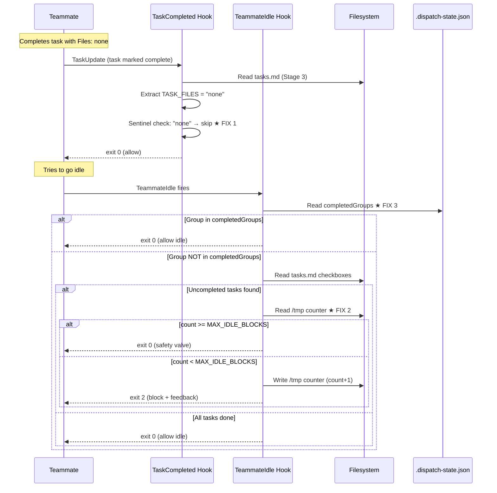

# Design: Hook Shutdown Fixes

## Overview

Three targeted fixes to two shell scripts break the cascade shutdown deadlock. Fix 1 adds sentinel value detection in task-completed-gate.sh Stage 3. Fixes 2+3 add a safety valve block counter and completedGroups bypass to teammate-idle-gate.sh. All changes are additive guards inserted before existing logic -- no existing behavior is removed.

## Architecture

```mermaid
graph TB
    subgraph TaskCompleted["task-completed-gate.sh"]
        S1[Stage 1: Verify cmd] --> S1_5[Stage 1.5: VERIFY gate]
        S1_5 --> S2[Stage 2: Typecheck]
        S2 --> S3_SENTINEL["Stage 3: Sentinel check ★ FIX 1"]
        S3_SENTINEL -->|sentinel| S3_SKIP[Skip file check]
        S3_SENTINEL -->|real files| S3[Stage 3: File existence]
        S3_SKIP --> S4[Stage 4: Build]
        S3 --> S4
        S4 --> S5[Stage 5: Test]
        S5 --> S6[Stage 6: Lint]
    end

    subgraph TeammateIdle["teammate-idle-gate.sh"]
        T1[Parse input] --> T2[Non-dispatch? Allow]
        T2 --> T3["completedGroups bypass ★ FIX 3"]
        T3 -->|group done| ALLOW[exit 0]
        T3 -->|not done| T4[Check tasks.md]
        T4 -->|all done| ALLOW
        T4 -->|uncompleted| T5["Safety valve check ★ FIX 2"]
        T5 -->|count >= MAX| ALLOW
        T5 -->|count < MAX| BLOCK[exit 2]
    end
```



## Fix 1: Sentinel File Values (task-completed-gate.sh)

**Location**: Lines 215-219 of `ralph-parallel/hooks/scripts/task-completed-gate.sh`
**Requirement**: FR-1 (AC-1.1 through AC-1.7)

Insert a sentinel check immediately after `TASK_FILES` is extracted (line 215) and before the `if [ -n "$TASK_FILES" ]` guard (line 220).

### Exact Code Change

```bash
# Current code (lines 206-220):
# --- Stage 3: File existence check ---
TASK_FILES=""
IN_TASK=false
while IFS= read -r fline; do
  if echo "$fline" | grep -qE "^\s*- \[.\] ${COMPLETED_SPEC_TASK}\b"; then
    IN_TASK=true; continue
  fi
  if [ "$IN_TASK" = true ] && echo "$fline" | grep -qE "^\s*- \[.\] [0-9]"; then break; fi
  if [ "$IN_TASK" = true ] && echo "$fline" | grep -qE "\*\*Files\*\*:"; then
    TASK_FILES=$(echo "$fline" | sed 's/.*\*\*Files\*\*:[[:space:]]*//' | sed 's/`//g' | sed 's/ *(NEW)//g; s/ *(MODIFY)//g; s/ *(CREATE)//g' | sed 's/^[[:space:]]*//;s/[[:space:]]*$//')
    break
  fi
done < "$SPEC_DIR/tasks.md"

# ★ INSERT HERE (after line 218, before line 220):
# Skip file check for sentinel values (none, n/a, -, empty)
case "$(echo "$TASK_FILES" | tr '[:upper:]' '[:lower:]')" in
  none|n/a|n/a\ *|-|"") TASK_FILES="" ;;
esac

if [ -n "$TASK_FILES" ]; then
  # ... existing file existence check unchanged ...
```

**How it works**:
1. Lowercases `TASK_FILES` for case-insensitive matching
2. Matches: `none`, `n/a`, `n/a (anything)`, `-`, empty string
3. Sets `TASK_FILES=""` so the existing `if [ -n "$TASK_FILES" ]` guard skips the entire file check block
4. Real file paths (e.g., `src/foo.ts`) pass through unchanged

**Sentinel patterns matched** (from real tasks.md files):

| Input | Lowercased | Case Match | Result |
|-------|-----------|------------|--------|
| `none` | `none` | `none` | Skip |
| `None` | `none` | `none` | Skip |
| `NONE` | `none` | `none` | Skip |
| `N/A` | `n/a` | `n/a` | Skip |
| `n/a` | `n/a` | `n/a` | Skip |
| `N/A (validation only)` | `n/a (validation only)` | `n/a *` | Skip |
| `-` | `-` | `-` | Skip |
| `` (empty) | `` | `""` | Skip |
| `src/foo.ts` | `src/foo.ts` | no match | Check |

## Fix 2: Safety Valve for TeammateIdle (teammate-idle-gate.sh)

**Location**: `ralph-parallel/hooks/scripts/teammate-idle-gate.sh` (full rewrite)
**Requirement**: FR-2, FR-4, FR-5 (AC-2.1 through AC-2.7)

Port the `read_block_counter`/`write_block_counter` pattern from dispatch-coordinator.sh. The counter functions are inlined (not shared) per NFR-5 (hook isolation).

### Counter Design

| Aspect | Value |
|--------|-------|
| Counter file | `/tmp/ralph-idle-${SPEC_NAME}-${TEAMMATE_NAME}` |
| Format | `count:status:dispatchedAt` |
| Default max | 5 (via `RALPH_MAX_IDLE_BLOCKS` env var) |
| Reset trigger | `status` or `dispatchedAt` mismatch |
| Safety valve | `count >= MAX_IDLE_BLOCKS` -> exit 0 + stderr warning |

### Integration Point

The safety valve check goes between the uncompleted-tasks detection and the `exit 2` block:

```
Parse input -> Non-dispatch check -> completedGroups check (Fix 3)
  -> tasks.md check -> found uncompleted? -> SAFETY VALVE -> exit 2
```

## Fix 3: completedGroups Check (teammate-idle-gate.sh)

**Location**: Same file as Fix 2 (teammate-idle-gate.sh)
**Requirement**: FR-3 (AC-3.1 through AC-3.5)

Insert a completedGroups check AFTER the dispatch state is loaded but BEFORE the tasks.md checkbox loop. This uses the authoritative completion source (dispatch state) rather than potentially stale tasks.md.

### Logic

```bash
# Check dispatch state first -- if group is in completedGroups, allow idle
TEAMMATE_GROUP_DONE=$(jq -r --arg name "$TEAMMATE_NAME" \
  '.completedGroups // [] | map(select(. == $name)) | length > 0' \
  "$DISPATCH_STATE" 2>/dev/null) || TEAMMATE_GROUP_DONE="false"

if [ "$TEAMMATE_GROUP_DONE" = "true" ]; then
  echo "ralph-parallel: Group '$TEAMMATE_NAME' in completedGroups — allowing idle" >&2
  exit 0
fi
```

Uses `map(select(...)) | length > 0` instead of `index($name) != null` because `index` returns `null` for not-found which jq treats differently across versions. The `map/select/length` pattern is more portable.

## Complete Modified teammate-idle-gate.sh

```bash
#!/bin/bash
# Ralph Parallel - Teammate Idle Quality Gate
# Prevents teammates from going idle when they have uncompleted tasks.
#
# Safety valve: after MAX_IDLE_BLOCKS repeated blocks, allows idle to prevent
# infinite token-burning loops. Counter resets on dispatch identity change.
#
# Exit codes:
#   0 = allow idle
#   2 = block idle + send stderr as feedback

set -euo pipefail

# --- Counter functions (inlined from dispatch-coordinator.sh pattern) ---

read_block_counter() {
  local counter_file="$1"
  local current_status="$2"
  local dispatched_at="$3"

  if [ ! -f "$counter_file" ]; then
    echo "0"
    return
  fi

  local stored
  stored=$(cat "$counter_file" 2>/dev/null) || { echo "0"; return; }
  local stored_count stored_status stored_ts
  stored_count=$(echo "$stored" | cut -d: -f1)
  stored_status=$(echo "$stored" | cut -d: -f2)
  stored_ts=$(echo "$stored" | cut -d: -f3)

  # Reset if dispatch identity changed
  if [ "$stored_status" != "$current_status" ] || [ "$stored_ts" != "$dispatched_at" ]; then
    echo "0"
    return
  fi

  echo "${stored_count:-0}"
}

write_block_counter() {
  local counter_file="$1"
  local count="$2"
  local current_status="$3"
  local dispatched_at="$4"
  echo "${count}:${current_status}:${dispatched_at}" > "$counter_file" 2>/dev/null || true
}

# --- Parse input ---

INPUT=$(cat)
TEAM_NAME=$(echo "$INPUT" | jq -r '.team_name // empty' 2>/dev/null) || TEAM_NAME=""
TEAMMATE_NAME=$(echo "$INPUT" | jq -r '.teammate_name // empty' 2>/dev/null) || TEAMMATE_NAME=""
CWD=$(echo "$INPUT" | jq -r '.cwd // empty' 2>/dev/null) || CWD=""

# Not a dispatch team — allow idle
if [ -z "$TEAM_NAME" ] || [[ "$TEAM_NAME" != *-parallel ]]; then
  exit 0
fi

SPEC_NAME="${TEAM_NAME%-parallel}"
PROJECT_ROOT=$(git rev-parse --show-toplevel 2>/dev/null) || PROJECT_ROOT="${CWD:-$(pwd)}"
SPEC_DIR="$PROJECT_ROOT/specs/$SPEC_NAME"
DISPATCH_STATE="$SPEC_DIR/.dispatch-state.json"

# No dispatch state — allow idle
if [ ! -f "$DISPATCH_STATE" ]; then
  exit 0
fi

# --- Read dispatch identity for counter ---
STATUS=$(jq -r '.status // "unknown"' "$DISPATCH_STATE" 2>/dev/null) || STATUS="unknown"
DISPATCHED_AT=$(jq -r '.dispatchedAt // "unknown"' "$DISPATCH_STATE" 2>/dev/null) || DISPATCHED_AT="unknown"

MAX_IDLE_BLOCKS="${RALPH_MAX_IDLE_BLOCKS:-5}"
COUNTER_FILE="/tmp/ralph-idle-${SPEC_NAME}-${TEAMMATE_NAME}"

# --- completedGroups bypass (authoritative source, checked before tasks.md) ---
TEAMMATE_GROUP_DONE=$(jq -r --arg name "$TEAMMATE_NAME" \
  '.completedGroups // [] | map(select(. == $name)) | length > 0' \
  "$DISPATCH_STATE" 2>/dev/null) || TEAMMATE_GROUP_DONE="false"

if [ "$TEAMMATE_GROUP_DONE" = "true" ]; then
  echo "ralph-parallel: Group '$TEAMMATE_NAME' in completedGroups — allowing idle" >&2
  exit 0
fi

# Find the group matching this teammate
GROUP_TASKS=$(jq -r --arg name "$TEAMMATE_NAME" \
  '.groups[] | select(.name == $name) | .tasks[]' \
  "$DISPATCH_STATE" 2>/dev/null) || GROUP_TASKS=""

# Teammate not in any group — allow idle
if [ -z "$GROUP_TASKS" ]; then
  exit 0
fi

# Check tasks.md for uncompleted tasks
TASKS_MD="$SPEC_DIR/tasks.md"
if [ ! -f "$TASKS_MD" ]; then
  exit 0
fi

UNCOMPLETED=""
for TASK_ID in $GROUP_TASKS; do
  if grep -qE "^\s*- \[ \] ${TASK_ID}\b" "$TASKS_MD"; then
    DESC=$(grep -oE "^\s*- \[ \] ${TASK_ID}\s+.*" "$TASKS_MD" | sed "s/.*${TASK_ID}\s*//" | head -1)
    UNCOMPLETED="${UNCOMPLETED}  - ${TASK_ID}: ${DESC}\n"
  fi
done

if [ -z "$UNCOMPLETED" ]; then
  # All group tasks complete in tasks.md — allow idle
  exit 0
fi

# --- Safety valve check ---
BLOCK_COUNT=$(read_block_counter "$COUNTER_FILE" "$STATUS" "$DISPATCHED_AT")

if [ "$BLOCK_COUNT" -ge "$MAX_IDLE_BLOCKS" ] 2>/dev/null; then
  echo "ralph-parallel: SAFETY VALVE — allowing idle after $BLOCK_COUNT blocks (max $MAX_IDLE_BLOCKS)" >&2
  echo "ralph-parallel: Teammate '$TEAMMATE_NAME' may have stuck tasks. Check dispatch state." >&2
  exit 0
fi

# --- Increment counter and block ---
NEW_COUNT=$((BLOCK_COUNT + 1))
write_block_counter "$COUNTER_FILE" "$NEW_COUNT" "$STATUS" "$DISPATCHED_AT"

echo "Continue working. You have uncompleted tasks (block $NEW_COUNT/$MAX_IDLE_BLOCKS):" >&2
echo -e "$UNCOMPLETED" >&2
echo "Claim the next uncompleted task, implement it, and mark it complete." >&2
exit 2
```

## Data Flow



## Technical Decisions

| Decision | Options Considered | Choice | Rationale |
|----------|-------------------|--------|-----------|
| Sentinel matching | Regex, case statement, if/elif | `case` with `tr` | Portable, readable, handles all patterns in 1 line. `case` is POSIX and faster than regex for simple patterns. |
| Counter functions | Shared lib, inline copy | Inline copy | NFR-5 requires hook isolation. Shared lib adds a dependency and fragility (path resolution in plugin). |
| MAX_IDLE_BLOCKS default | 3 (match Stop), 5, 10 | 5 | Teammates should retry harder than the lead (granular tasks). But 10 is too many blocks before escape. |
| completedGroups check method | `index() != null`, `any(. == $name)`, `map/select/length` | `map/select/length > 0` | Most portable across jq versions. `any()` is cleaner but added later to jq. `index` has null-handling quirks. |
| Counter file key | `SPEC_NAME-TEAMMATE_NAME`, `SPEC_NAME-SESSION_ID` | `SPEC_NAME-TEAMMATE_NAME` | Teammate name is stable across blocks. Session ID could change mid-dispatch (teammate restart). |
| Logging | Silent, stderr only, file log | stderr | Consistent with dispatch-coordinator.sh. stderr is visible in verbose mode and captured in test assertions. |

## File Structure

| File | Action | Purpose |
|------|--------|---------|
| `ralph-parallel/hooks/scripts/task-completed-gate.sh` | Modify | Add 3-line sentinel check after line 218 (Fix 1) |
| `ralph-parallel/hooks/scripts/teammate-idle-gate.sh` | Modify | Add counter functions, completedGroups check, safety valve (Fixes 2+3) |
| `ralph-parallel/hooks/scripts/test_gate.sh` | Modify | Add 3 sentinel value test cases (TR-1 through TR-3) |
| `ralph-parallel/hooks/scripts/test_teammate_idle_gate.sh` | Create | New test file with 7+ test cases (TR-4 through TR-11) |

## Error Handling

| Error Scenario | Handling Strategy | User Impact |
|----------------|-------------------|-------------|
| jq fails reading dispatch state | `\|\| TEAMMATE_GROUP_DONE="false"` — falls through to tasks.md check | No regression; behaves like current code |
| Counter file unreadable | `read_block_counter` returns "0" — blocks without counter tracking | Safety valve won't trigger; blocks until dispatch terminal state (safe but less user-friendly) |
| Counter file unwritable | `write_block_counter` uses `\|\| true` — non-fatal | Same as above |
| completedGroups missing from JSON | `// []` default — empty array, `length > 0` is false | Falls through to tasks.md check (backward compat) |
| TEAMMATE_NAME empty | `GROUP_TASKS` will be empty — allow idle | Teammate not in any group = no tasks to enforce |
| DISPATCHED_AT missing | Defaults to `"unknown"` — counter resets on mismatch | First block after state change starts fresh (correct behavior) |

## Edge Cases

- **Empty TASK_FILES after sed**: The `""` case in the sentinel match already handles this. No change needed.
- **Files field with comma-separated sentinels**: e.g., `**Files**: none, -`. The case statement checks the full string, not individual items. This would NOT match and would fall through to the file check, which would try to check `none` and `-` as files. This is acceptable -- comma-separated sentinels are not a real pattern in the codebase.
- **Teammate name with special chars**: Counter file path uses `SPEC_NAME-TEAMMATE_NAME` which could contain spaces. In practice, group names are slug-formatted (e.g., `data-models`). No sanitization needed.
- **Race condition on counter file**: Two blocks firing near-simultaneously could read the same count. The `read -> increment -> write` pattern is not atomic, but TeammateIdle fires sequentially for a given teammate (one turn at a time). No race possible.
- **Dispatch re-dispatch (same spec, new dispatchedAt)**: Counter resets automatically via dispatchedAt mismatch check. New dispatch gets a fresh counter.
- **completedGroups contains group but tasks.md still shows unchecked**: This is the Bug 3 scenario. completedGroups bypass exits immediately -- tasks.md is never checked. Correct behavior.

## Test Design

### test_gate.sh Additions (Fix 1)

Add 3 test cases after existing tests, following the established `setup_*` + `run_test` pattern.

```bash
# ── New setup functions for sentinel tests ────────────────────

setup_files_none() {
  local dir="$1"
  cat > "$dir/specs/test-spec/tasks.md" <<'EOF'
- [ ] 1.1 Test task
  - **Verify**: `true`
  - **Files**: none
EOF
}

setup_files_na_with_note() {
  local dir="$1"
  cat > "$dir/specs/test-spec/tasks.md" <<'EOF'
- [ ] 1.1 Test task
  - **Verify**: `true`
  - **Files**: N/A (validation only)
EOF
}

setup_files_dash() {
  local dir="$1"
  cat > "$dir/specs/test-spec/tasks.md" <<'EOF'
- [ ] 1.1 Test task
  - **Verify**: `true`
  - **Files**: -
EOF
}

# ── New test invocations ──────────────────────────────────────

run_test "files sentinel: none"              0  ""  setup_files_none
run_test "files sentinel: N/A (with note)"   0  ""  setup_files_na_with_note
run_test "files sentinel: dash"              0  ""  setup_files_dash
```

These go before the summary section. Expected: all 3 pass with exit 0 (sentinel recognized, file check skipped). The existing `setup_file_exist_fail` test (exit 2, `Missing files`) continues to pass -- it uses a real filename (`nonexistent-file.ts`), not a sentinel.

### test_teammate_idle_gate.sh (New File for Fixes 2+3)

Follows the test_gate.sh pattern: `run_test()` with expected exit code and stderr check, `setup_*` functions that populate tmpdir.

**Key difference from test_gate.sh**: teammate-idle-gate.sh reads `CLAUDE_CODE_AGENT_NAME` (no -- it reads `teammate_name` from JSON input) and checks both dispatch state and tasks.md. Each setup function must create both files.

```bash
#!/bin/bash
# Integration tests for teammate-idle-gate.sh
set -euo pipefail

GATE_SCRIPT="$(cd "$(dirname "$0")" && pwd)/teammate-idle-gate.sh"
PASS=0
FAIL=0

run_test() {
  local name="$1"
  local expected_exit="$2"
  local check_stderr="$3"  # substring to look for in stderr, or empty
  shift 3

  local tmpdir
  tmpdir=$(mktemp -d)
  trap "rm -rf $tmpdir" RETURN

  mkdir -p "$tmpdir/specs/test-spec"

  # Let test setup function populate files and set env
  "$@" "$tmpdir"

  # Build input JSON (teammate_name set by setup or default)
  local teammate_name="${TEST_TEAMMATE_NAME:-test-group}"
  local input
  input=$(cat <<JSON
{"team_name":"test-spec-parallel","teammate_name":"$teammate_name","cwd":"$tmpdir"}
JSON
  )

  local stderr_file="$tmpdir/stderr.txt"
  local exit_code=0
  echo "$input" | bash "$GATE_SCRIPT" 2>"$stderr_file" || exit_code=$?

  if [ "$exit_code" -ne "$expected_exit" ]; then
    echo "FAIL: $name — expected exit $expected_exit, got $exit_code"
    cat "$stderr_file"
    FAIL=$((FAIL + 1))
    unset TEST_TEAMMATE_NAME
    return
  fi

  if [ -n "$check_stderr" ]; then
    if ! grep -q "$check_stderr" "$stderr_file" 2>/dev/null; then
      echo "FAIL: $name — expected '$check_stderr' in stderr"
      cat "$stderr_file"
      FAIL=$((FAIL + 1))
      unset TEST_TEAMMATE_NAME
      return
    fi
  fi

  echo "PASS: $name"
  PASS=$((PASS + 1))
  unset TEST_TEAMMATE_NAME
}

# ── Setup functions ──────────────────────────────────────────

setup_all_tasks_done() {
  local dir="$1"
  cat > "$dir/specs/test-spec/.dispatch-state.json" <<'EOF'
{"status":"dispatched","dispatchedAt":"2026-03-04T00:00:00Z",
 "groups":[{"name":"test-group","tasks":["1.1","1.2"]}],
 "completedGroups":[]}
EOF
  cat > "$dir/specs/test-spec/tasks.md" <<'EOF'
- [x] 1.1 First task
- [x] 1.2 Second task
EOF
}

setup_uncompleted_tasks() {
  local dir="$1"
  # Clean any stale counter
  rm -f "/tmp/ralph-idle-test-spec-test-group" 2>/dev/null || true
  cat > "$dir/specs/test-spec/.dispatch-state.json" <<'EOF'
{"status":"dispatched","dispatchedAt":"2026-03-04T00:00:00Z",
 "groups":[{"name":"test-group","tasks":["1.1","1.2"]}],
 "completedGroups":[]}
EOF
  cat > "$dir/specs/test-spec/tasks.md" <<'EOF'
- [x] 1.1 First task
- [ ] 1.2 Second task
EOF
}

setup_safety_valve() {
  local dir="$1"
  # Pre-seed counter at MAX_IDLE_BLOCKS (5)
  echo "5:dispatched:2026-03-04T00:00:00Z" > "/tmp/ralph-idle-test-spec-test-group"
  cat > "$dir/specs/test-spec/.dispatch-state.json" <<'EOF'
{"status":"dispatched","dispatchedAt":"2026-03-04T00:00:00Z",
 "groups":[{"name":"test-group","tasks":["1.1","1.2"]}],
 "completedGroups":[]}
EOF
  cat > "$dir/specs/test-spec/tasks.md" <<'EOF'
- [x] 1.1 First task
- [ ] 1.2 Second task
EOF
}

setup_counter_reset() {
  local dir="$1"
  # Counter from OLD dispatch (different dispatchedAt)
  echo "10:dispatched:2026-01-01T00:00:00Z" > "/tmp/ralph-idle-test-spec-test-group"
  cat > "$dir/specs/test-spec/.dispatch-state.json" <<'EOF'
{"status":"dispatched","dispatchedAt":"2026-03-04T00:00:00Z",
 "groups":[{"name":"test-group","tasks":["1.1","1.2"]}],
 "completedGroups":[]}
EOF
  cat > "$dir/specs/test-spec/tasks.md" <<'EOF'
- [x] 1.1 First task
- [ ] 1.2 Second task
EOF
}

setup_completed_groups_bypass() {
  local dir="$1"
  rm -f "/tmp/ralph-idle-test-spec-test-group" 2>/dev/null || true
  cat > "$dir/specs/test-spec/.dispatch-state.json" <<'EOF'
{"status":"dispatched","dispatchedAt":"2026-03-04T00:00:00Z",
 "groups":[{"name":"test-group","tasks":["1.1","1.2"]}],
 "completedGroups":["test-group"]}
EOF
  # tasks.md still shows uncompleted — should be ignored
  cat > "$dir/specs/test-spec/tasks.md" <<'EOF'
- [x] 1.1 First task
- [ ] 1.2 Second task
EOF
}

setup_non_dispatch_team() {
  local dir="$1"
  # team_name without -parallel suffix handled by run_test input override
  export TEST_TEAMMATE_NAME="test-group"
}

setup_no_dispatch_state() {
  local dir="$1"
  # No .dispatch-state.json — should allow idle
  cat > "$dir/specs/test-spec/tasks.md" <<'EOF'
- [ ] 1.1 First task
EOF
}

# ── Run tests ─────────────────────────────────────────────────

run_test "all tasks complete — allow idle"           0  ""                     setup_all_tasks_done
run_test "uncompleted tasks — block idle"            2  "uncompleted tasks"    setup_uncompleted_tasks
run_test "safety valve — allow after MAX blocks"     0  "SAFETY VALVE"         setup_safety_valve
run_test "counter reset on dispatch change — block"  2  "uncompleted tasks"    setup_counter_reset
run_test "completedGroups bypass — allow idle"       0  "completedGroups"      setup_completed_groups_bypass
run_test "no dispatch state — allow idle"            0  ""                     setup_no_dispatch_state

# Non-dispatch team test needs a modified input (no -parallel suffix)
# Handled inline since run_test builds input from team_name
run_test_non_dispatch() {
  local tmpdir
  tmpdir=$(mktemp -d)
  trap "rm -rf $tmpdir" RETURN
  mkdir -p "$tmpdir/specs/test-spec"

  local input='{"team_name":"regular-team","teammate_name":"worker","cwd":"'"$tmpdir"'"}'
  local stderr_file="$tmpdir/stderr.txt"
  local exit_code=0
  echo "$input" | bash "$GATE_SCRIPT" 2>"$stderr_file" || exit_code=$?

  if [ "$exit_code" -eq 0 ]; then
    echo "PASS: non-dispatch team — allow idle"
    PASS=$((PASS + 1))
  else
    echo "FAIL: non-dispatch team — expected exit 0, got $exit_code"
    FAIL=$((FAIL + 1))
  fi
}
run_test_non_dispatch

# ── Cleanup ──────────────────────────────────────────────────

rm -f "/tmp/ralph-idle-test-spec-test-group" 2>/dev/null || true

# ── Summary ──────────────────────────────────────────────────

echo ""
echo "Results: $PASS passed, $FAIL failed out of $((PASS + FAIL))"
[ "$FAIL" -eq 0 ] && exit 0 || exit 1
```

### Test Matrix

| Test | Setup | Expected Exit | Stderr Check | Covers |
|------|-------|---------------|--------------|--------|
| All tasks complete | `[x]` checkboxes, not in completedGroups | 0 | - | TR-5 |
| Uncompleted tasks | `[ ]` checkbox, fresh counter | 2 | `uncompleted tasks` | TR-6 |
| Safety valve | Counter pre-seeded at 5 | 0 | `SAFETY VALVE` | TR-7 |
| Counter reset | Counter=10 but old dispatchedAt | 2 | `uncompleted tasks` | TR-8 |
| completedGroups bypass | Group in completedGroups, stale tasks.md | 0 | `completedGroups` | TR-9 |
| No dispatch state | No .dispatch-state.json file | 0 | - | TR-11 |
| Non-dispatch team | team_name without `-parallel` | 0 | - | TR-10 |

## Risk Assessment

| Risk | Likelihood | Impact | Mitigation |
|------|-----------|--------|------------|
| Sentinel match is too broad | Low | Medium (skips file check for real file named "none") | No real codebase has a file literally named `none`. Pattern is exhaustive from grep across all specs. |
| Counter file race condition | None | N/A | TeammateIdle fires sequentially per teammate (one turn at a time). |
| jq version incompatibility | Low | Low | `map/select/length` is available in jq 1.4+. macOS ships jq 1.6+. |
| Breaking existing test_gate.sh tests | None | High | Fix 1 is purely additive (new guard before existing code). All 7 existing tests use real filenames or no Files field -- none use sentinels. |
| Counter file clutters /tmp | Low | None | Files are ~30 bytes each, named with spec+teammate. OS cleanup handles. |

## Backward Compatibility

1. **task-completed-gate.sh**: The sentinel check only activates for values that currently cause false-positive blocks. Real file paths pass through unchanged. All 7 existing tests are unaffected.

2. **teammate-idle-gate.sh**: The completedGroups check is a new early-exit path that didn't exist before. If completedGroups is absent or empty, falls through to existing tasks.md logic. The safety valve is a new late-exit path after the existing block logic. Both are strictly additive.

3. **hooks.json**: No changes. Both hooks remain registered with same commands and timeouts.

4. **Counter file format**: Matches dispatch-coordinator.sh exactly (`count:status:dispatchedAt`). Consistent pattern across hooks.

## Performance Considerations

- Sentinel check: single `case` statement + `tr`, negligible overhead (~1ms)
- completedGroups check: one `jq` invocation on dispatch state (~10ms). Already loaded by teammate-idle-gate.sh.
- Counter read/write: one `cat` + one `echo >` on /tmp file (~1ms each)
- Total added overhead per TeammateIdle invocation: ~15ms. Well within NFR-3 target (<1s).

## Implementation Steps

1. Add sentinel check to `ralph-parallel/hooks/scripts/task-completed-gate.sh` (3 lines after line 218)
2. Add 3 sentinel test cases to `ralph-parallel/hooks/scripts/test_gate.sh`
3. Rewrite `ralph-parallel/hooks/scripts/teammate-idle-gate.sh` with counter functions, completedGroups check, safety valve
4. Create `ralph-parallel/hooks/scripts/test_teammate_idle_gate.sh` with 7 test cases
5. Run `bash -n` syntax check on both modified scripts
6. Run full test suite: `test_gate.sh` (10 tests), `test_teammate_idle_gate.sh` (7 tests), `test_stop_hook.sh` (22 tests)
