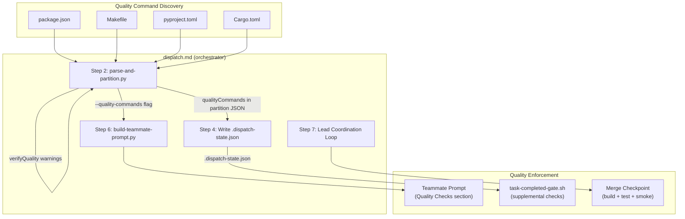
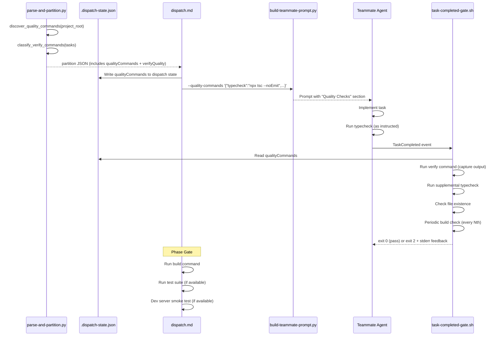

# Design: Parallel QA Overhaul

## Overview

Replaces grep-based verification theater with a multi-layer quality pipeline. Quality commands are auto-discovered from project config files during partition, propagated through partition JSON to teammate prompts and the per-task gate hook, and enforced at three checkpoints: per-task (supplemental typecheck + periodic build), per-phase (lead runs build + tests), and merge (full build verification).

## Architecture



## Data Flow



## Components

### Component 1: Quality Command Discovery (`parse-and-partition.py`)

**Purpose**: Detect project-specific quality commands from config files.

**New function**: `discover_quality_commands(project_root: str) -> dict`

```python
def discover_quality_commands(project_root: str) -> dict:
    """Discover quality commands from project config files.

    Returns:
        {
            "typecheck": "npx tsc --noEmit" | null,
            "build": "npx vite build" | null,
            "test": "npx vitest run" | null,
            "lint": "npx eslint ." | null,
            "dev": "npx vite" | null
        }
    """
```

**Discovery strategy per ecosystem:**

| Config File | Parsed Fields | Command Mapping |
|-------------|---------------|-----------------|
| `package.json` | `scripts.*` | typecheck=scripts.typecheck, build=scripts.build, test=scripts.test, lint=scripts.lint, dev=scripts.dev/start |
| `pyproject.toml` | `[project.scripts]`, `[tool.pytest]` | test="pytest" if pytest config exists, lint="ruff check" if ruff in deps |
| `Makefile` | Target names | test=make test, build=make build, lint=make lint (targets matched by name) |
| `Cargo.toml` | Existence check | build="cargo build", test="cargo test", lint="cargo clippy" |

**Fallback**: When a `package.json` script value is a bare command (e.g., `"test": "vitest"`), prefix with `npx` to avoid path issues. When script value contains `&&` or complex shell, use as-is.

**Integration point**: Called in `main()` after reading tasks.md, before `partition_tasks()`. Result added to partition output dict.

### Component 2: Verify Command Classification (`parse-and-partition.py`)

**Purpose**: Classify verify commands by quality tier, emit warnings.

**New function**: `classify_verify_commands(tasks: list[dict]) -> dict`

```python
WEAK_PATTERNS = ['grep', 'ls ', 'cat ', 'echo ', 'true', 'test -f', 'wc ']
STATIC_PATTERNS = ['tsc', 'typecheck', 'lint', 'eslint', 'prettier', 'mypy', 'pyright', 'clippy', 'ruff']
RUNTIME_PATTERNS = ['build', 'vite', 'webpack', 'test', 'vitest', 'jest', 'pytest', 'cargo test',
                    'curl', 'serve', 'node ', 'python3 ']

def classify_verify_commands(tasks: list[dict]) -> dict:
    """Classify verify commands into quality tiers.

    Returns:
        {
            "runtime": 3,
            "static": 5,
            "weak": 12,
            "none": 2,
            "details": [{"taskId": "1.1", "tier": "weak", "command": "grep ..."}]
        }
    """
```

**Classification logic**: Match verify command string against pattern lists. First match wins (checked in order: runtime, static, weak). Empty verify = "none".

**Warning output**: Added to `format_plan()` output when `weak / total > 0.5`:

```
WARNING: 12/20 tasks have weak verify commands (grep/ls/cat).
Consider adding build/test verify commands to tasks.md before dispatch.
```

### Component 3: Partition JSON Schema Extension

**Current output** (top-level keys): `totalTasks`, `incompleteTasks`, `groups`, `serialTasks`, `verifyTasks`, `phaseCount`, `estimatedSpeedup`

**New keys added**:

```json
{
  "qualityCommands": {
    "typecheck": "npx tsc --noEmit",
    "build": "npx vite build",
    "test": null,
    "lint": null,
    "dev": "npx vite"
  },
  "verifyQuality": {
    "runtime": 1,
    "static": 5,
    "weak": 17,
    "none": 2
  }
}
```

### Component 4: Dispatch State Extension (`.dispatch-state.json`)

**Current fields**: `dispatchedAt`, `strategy`, `maxTeammates`, `groups`, `serialTasks`, `verifyTasks`, `status`, `completedGroups`

**New field**:

```json
{
  "qualityCommands": {
    "typecheck": "npx tsc --noEmit",
    "build": "npx vite build",
    "test": null,
    "lint": null,
    "dev": "npx vite"
  }
}
```

Written by dispatch.md Step 4 from partition JSON. Read by task-completed-gate.sh.

### Component 5: Teammate Prompt Enhancement (`build-teammate-prompt.py`)

**New CLI argument**: `--quality-commands` (JSON string)

```python
parser.add_argument('--quality-commands', default='{}',
    help='JSON string of quality commands (e.g., \'{"typecheck":"npx tsc --noEmit"}\')')
```

**New function**: `build_quality_section(quality_commands: dict) -> list[str]`

Generates a "Quality Checks" section inserted between "File Ownership" and "Rules":

```markdown
## Quality Checks

- After EACH task, run typecheck: `npx tsc --noEmit`
  If it fails, fix errors BEFORE marking the task complete.
- Verify your code builds: `npx vite build`
- When no quality commands are available:
  "Run any available project checks (build, lint, typecheck) after each task."
```

When `test` command is available, adds:

```markdown
- Write at least one test per implementation task. Run tests: `npx vitest run`
```

**Changes to `build_prompt()`**: Accept `quality_commands` parameter, call `build_quality_section()`, insert output between ownership and rules sections.

**Changes to `main()`**: Parse `--quality-commands` arg, json.loads() it, pass to `build_prompt()`.

### Component 6: Enhanced Per-Task Gate (`task-completed-gate.sh`)

**Current behavior**: Extract verify command -> `eval "$VERIFY_CMD" >/dev/null 2>&1` -> exit 0 or exit 2.

**New behavior** (5 stages):

```
Stage 1: Run verify command (CAPTURE output instead of suppressing)
Stage 2: Run supplemental typecheck (if qualityCommands.typecheck exists)
Stage 3: Verify file existence (check task's Files: entries exist)
Stage 4: Periodic build check (if qualityCommands.build exists, every Nth task)
Stage 5: Report results (pass all = exit 0, any fail = exit 2 with stderr feedback)
```

**Stage 1 - Verify with output capture**:

```bash
VERIFY_OUTPUT=$(eval "$VERIFY_CMD" 2>&1) || {
    VERIFY_EXIT=$?
    echo "QUALITY GATE FAILED for task $COMPLETED_SPEC_TASK" >&2
    echo "Verify command failed (exit $VERIFY_EXIT): $VERIFY_CMD" >&2
    echo "--- Output (last 50 lines) ---" >&2
    echo "$VERIFY_OUTPUT" | tail -50 >&2
    exit 2
}
```

**Stage 2 - Supplemental typecheck**:

```bash
# Read quality commands from dispatch state
DISPATCH_STATE="$SPEC_DIR/.dispatch-state.json"
TYPECHECK_CMD=$(jq -r '.qualityCommands.typecheck // empty' "$DISPATCH_STATE" 2>/dev/null)

if [ -n "$TYPECHECK_CMD" ]; then
    TC_OUTPUT=$(eval "$TYPECHECK_CMD" 2>&1) || {
        echo "SUPPLEMENTAL CHECK FAILED: typecheck" >&2
        echo "Command: $TYPECHECK_CMD" >&2
        echo "$TC_OUTPUT" | tail -30 >&2
        exit 2
    }
fi
```

**Stage 3 - File existence check**:

Extract `Files:` line from task block in tasks.md, split on commas, check each file exists relative to project root. Missing files -> exit 2 with listing.

**Stage 4 - Periodic build check**:

```bash
BUILD_CMD=$(jq -r '.qualityCommands.build // empty' "$DISPATCH_STATE" 2>/dev/null)
BUILD_INTERVAL=3  # every 3rd task

if [ -n "$BUILD_CMD" ]; then
    # Count completed tasks for this group (by counting [x] marks in tasks.md for this group's tasks)
    COMPLETED_COUNT=$(grep -cE '^\s*- \[x\]' "$SPEC_DIR/tasks.md" 2>/dev/null || echo 0)

    # Also run build on last task in group (detect via task count from dispatch state)
    IS_LAST_IN_GROUP=false
    # ... (check group membership and completion count)

    if [ $((COMPLETED_COUNT % BUILD_INTERVAL)) -eq 0 ] || [ "$IS_LAST_IN_GROUP" = true ]; then
        BUILD_OUTPUT=$(eval "$BUILD_CMD" 2>&1) || {
            echo "SUPPLEMENTAL CHECK FAILED: build" >&2
            echo "Command: $BUILD_CMD" >&2
            echo "$BUILD_OUTPUT" | tail -50 >&2
            exit 2
        }
    fi
fi
```

**Backward compatibility**: If `.dispatch-state.json` has no `qualityCommands` key (older dispatches), stages 2-4 are skipped. Only Stage 1 (with output capture) applies, maintaining existing behavior with the improvement of visible error output.

### Component 7: Dispatch Lead Coordination (`dispatch.md`)

**Changes to Step 4**: Add `qualityCommands` from partition JSON to dispatch state.

**Changes to Step 6**: Pass `--quality-commands` flag to `build-teammate-prompt.py`:

```bash
python3 ${CLAUDE_PLUGIN_ROOT}/scripts/build-teammate-prompt.py \
  --partition-file /tmp/$specName-partition.json \
  --group-index $i \
  --spec-name $specName \
  --project-root $projectRoot \
  --task-ids "#$id1,#$id2,..." \
  --quality-commands "$QUALITY_COMMANDS_JSON"
```

**Changes to Step 7 PHASE GATE**: Replace current "run Phase N verify checkpoint" with:

```text
4. PHASE GATE: When ALL Phase N tasks done:
   a. Run Phase N verify checkpoint task
   b. Run full build: execute qualityCommands.build (from dispatch state)
   c. Run test suite: execute qualityCommands.test (if available)
   d. Runtime smoke test: if qualityCommands.dev exists:
      - Start dev server in background
      - Wait 5s for startup
      - curl http://localhost:5173 (or parse port from dev command)
      - Kill dev server
      - If curl fails: WARN but do not block (dev server is best-effort)
   e. If build/test FAIL: message affected teammates with error output
      Do NOT mark phase complete. Teammates must fix.
   f. If all pass: mark verify task completed, proceed
```

### Component 8: Merge Verification Update (`merge.md`)

**Changes to Step 3**: Replace "re-run Verify commands" with:

```text
3. CHECK: Build verification
   a. Run qualityCommands.build from .dispatch-state.json
   b. Run qualityCommands.test if available
   c. Run qualityCommands.lint if available
   d. Collect pass/fail per command
   e. If ANY fail: report specific failures, do NOT mark as merged
```

### Component 9: Hook Timeout (`hooks.json`)

**Change**: `TaskCompleted` timeout from 120 to 300.

```json
{
  "type": "command",
  "command": "${CLAUDE_PLUGIN_ROOT}/hooks/scripts/task-completed-gate.sh",
  "timeout": 300
}
```

## Technical Decisions

| Decision | Options Considered | Choice | Rationale |
|----------|-------------------|--------|-----------|
| Quality command source | a) Hardcoded per-ecosystem, b) Discover from config files, c) User-provided .qa-config.json | b) Discover from config | Zero config, works across ecosystems. .qa-config.json adds unnecessary complexity per requirements out-of-scope. |
| Where discovery runs | a) dispatch.md (in markdown), b) parse-and-partition.py, c) Separate script | b) parse-and-partition.py | Script already reads project files. Adding discovery keeps all analysis in one deterministic Python script. |
| How quality commands flow to gate | a) Gate reads partition JSON, b) Gate reads .dispatch-state.json, c) Pass as env var | b) .dispatch-state.json | Gate already resolves spec dir and reads tasks.md from there. dispatch-state.json is the canonical dispatch-time state store. |
| How quality commands flow to prompt builder | a) Builder reads dispatch state, b) CLI argument, c) Env var | b) CLI argument `--quality-commands` | Keeps script stateless. dispatch.md passes the JSON string. Clean interface boundary between orchestration (markdown) and script. |
| Verify output handling | a) Always show, b) Show on failure only, c) Log to file | b) Show on failure only | Success = no noise. Failure = actionable feedback. Avoids log file cleanup complexity. |
| Build check frequency | a) Every task, b) Every Nth task, c) Only on last task | b) Every 3rd + last task | Balance between catch-early and latency. Every task adds 20-60s overhead. Every 3rd keeps ~20s average overhead per task. |
| Typecheck frequency | a) Every task, b) Every Nth task, c) Only at verify checkpoints | a) Every task | Typecheck is fast (~5-15s). Catching type drift per-task prevents error cascading. |
| File existence check scope | a) All files in task, b) Only newly created files, c) Skip | a) All files in task | Simple, fast (stat calls), catches common "forgot to create file" errors. |
| Dev server smoke test strategy | a) Full HTTP check, b) Process start check, c) Skip | a) curl with timeout | Best-effort verification. Port conflicts are real risk but dev server check is Low priority (AC-5.3). 5s startup wait + 5s curl timeout = max 10s overhead. |
| Pattern matching for classify | a) Regex, b) Simple substring, c) AST parsing | b) Simple substring | Verify commands are short strings. Substring matching on known patterns (grep, tsc, build) is sufficient and maintainable. No false positives expected. |
| `--project-root` for discovery | a) New CLI arg, b) Infer from --tasks-md path, c) CWD | b) Infer from --tasks-md | `--tasks-md` is always `specs/$name/tasks.md` relative to project root. Walk up 2 dirs. Avoids adding a new required argument. |

## File Structure

| File | Action | Purpose |
|------|--------|---------|
| `ralph-parallel/scripts/parse-and-partition.py` | Modify | Add `discover_quality_commands()`, `classify_verify_commands()`, include results in partition output + format_plan warnings |
| `ralph-parallel/scripts/build-teammate-prompt.py` | Modify | Add `--quality-commands` arg, `build_quality_section()`, insert section in generated prompt |
| `ralph-parallel/hooks/scripts/task-completed-gate.sh` | Modify | Capture verify output, add supplemental typecheck/build/file-existence stages, read qualityCommands from dispatch state |
| `ralph-parallel/hooks/hooks.json` | Modify | Change TaskCompleted timeout 120 -> 300 |
| `ralph-parallel/commands/dispatch.md` | Modify | Step 4 adds qualityCommands to state, Step 6 passes --quality-commands to prompt builder, Step 7 PHASE GATE adds build+test+smoke |
| `ralph-parallel/commands/merge.md` | Modify | Step 3 uses build/test instead of re-running grep verify commands |

## Error Handling

| Error Scenario | Handling Strategy | User Impact |
|----------------|-------------------|-------------|
| No config files found (no package.json/Makefile/etc.) | All qualityCommands values null. Gate skips supplemental checks. Prompt shows generic guidance. | Graceful degradation; behaves like current system. |
| Config file exists but unparseable JSON | Catch json.JSONDecodeError, log warning to stderr, return nulls for that ecosystem | Warning in partition output, no crash |
| Typecheck command fails in gate | Capture output, send last 30 lines to stderr, exit 2 | Teammate sees type errors, can fix before re-completing |
| Build command fails in gate | Capture output, send last 50 lines to stderr, exit 2 | Teammate sees build errors |
| Build command times out (>300s) | Hook killed by timeout. Teammate sees generic timeout message. | May need manual `--timeout` increase in hooks.json. Documented. |
| File listed in task doesn't exist | Exit 2 with "Missing files: ..." message | Teammate prompted to create missing files |
| Dev server fails to start in merge checkpoint | Warn but do NOT block. Log the failure. | Lead sees warning, manual verification needed |
| Dev server port already in use | Curl fails, warn but do NOT block | Best-effort check; Low priority feature |
| qualityCommands missing from dispatch state (backward compat) | Gate stages 2-4 skipped. Prompt builder shows generic guidance. | Zero regression for older dispatches |
| Multiple package.json in monorepo | Use the one at project root only | May miss workspace-specific commands. Acceptable for v1. |

## Edge Cases

- **Monorepo with root + workspace package.json**: Discovery reads project root only. Workspace-level commands not discovered. Acceptable trade-off -- the dispatch already operates at project root level.
- **package.json script with `&&` chains**: Used as-is. Example: `"test": "vitest run && playwright test"` becomes `qualityCommands.test = "npx vitest run && playwright test"`. The `npx` prefix is only added for bare single-word commands.
- **Task with no Files field**: File existence check (Stage 3) skipped for that task. No error.
- **Task with Files pointing to directories**: `test -e` used instead of `test -f` so directories pass.
- **All tasks already have runtime verify commands**: Classification shows 0 weak, no warning emitted. No behavioral change from current system except output capture improvement.
- **Concurrent teammates running typecheck simultaneously**: Safe -- `tsc --noEmit` is read-only. Multiple concurrent invocations may slow each other down but will not produce incorrect results.
- **Python project with no pyproject.toml or Makefile**: Falls through all discovery paths, all qualityCommands null. Generic prompt guidance emitted.
- **Build that produces side effects (writes dist/)**: Build check in gate writes to dist/ which is outside teammate ownership. This is fine -- file-ownership-guard.sh only blocks Write/Edit tool calls, not shell commands.

## Test Strategy

### Unit Tests (parse-and-partition.py)

- `test_discover_quality_commands_node`: Mock package.json with various script configs
- `test_discover_quality_commands_python`: Mock pyproject.toml with pytest
- `test_discover_quality_commands_rust`: Mock Cargo.toml
- `test_discover_quality_commands_makefile`: Mock Makefile with standard targets
- `test_discover_quality_commands_none`: No config files, all nulls
- `test_discover_quality_commands_malformed`: Broken JSON, returns nulls
- `test_classify_verify_weak`: `grep -c 'export' file` -> weak
- `test_classify_verify_static`: `tsc --noEmit` -> static
- `test_classify_verify_runtime`: `vite build` -> runtime
- `test_classify_verify_empty`: No verify -> none
- `test_classify_verify_mixed`: Multiple tasks, correct counts
- `test_warning_threshold`: >50% weak triggers warning in format_plan

### Unit Tests (build-teammate-prompt.py)

- `test_quality_section_with_typecheck`: Includes typecheck instruction
- `test_quality_section_with_test`: Includes test-writing instruction
- `test_quality_section_with_build_only`: Includes build instruction (no test)
- `test_quality_section_empty`: Generic guidance when no commands
- `test_quality_commands_cli_arg`: JSON arg parsed correctly

### Integration Tests (task-completed-gate.sh)

- `test_gate_verify_output_on_failure`: Failing verify shows actual output
- `test_gate_verify_output_on_success`: Passing verify produces no extra output
- `test_gate_supplemental_typecheck`: Typecheck runs after verify passes
- `test_gate_file_existence_check`: Missing file blocks completion
- `test_gate_periodic_build`: Build runs on 3rd task
- `test_gate_backward_compat`: No qualityCommands in state -> verify-only behavior
- `test_gate_all_stages_pass`: All stages pass, exit 0

### Manual Testing

- Dispatch gpu-metrics-operator with new pipeline, verify:
  - Warning about weak verify commands in partition plan
  - Teammate prompts include "run tsc --noEmit after each task"
  - Gate catches type errors per-task
  - Lead runs `vite build` at phase gate

## Performance Considerations

| Check | Added Time | Frequency | Impact per 25-task dispatch |
|-------|-----------|-----------|---------------------------|
| Quality command discovery | <1s | Once (partition) | Negligible |
| Verify classification | <100ms | Once (partition) | Negligible |
| Typecheck (supplemental) | 5-15s | Every task | +2-6 min total |
| File existence check | <100ms | Every task | Negligible |
| Build (supplemental) | 15-60s | Every 3rd task + last | +1-4 min total |
| Build (merge checkpoint) | 15-60s | Once per phase | +0.5-2 min |
| Test suite (merge checkpoint) | Varies | Once per phase | Project-dependent |
| Dev server smoke test | 10-15s | Once per phase | +10-15s |
| **Total overhead** | | | **+4-12 min** on a 25-task dispatch |

Trade-off: 4-12 min overhead vs catching real bugs during dispatch instead of after. Current dispatches complete in ~6-22 min, so this is a 20-50% increase in wall time. Justified because the current pipeline catches zero runtime errors.

## Security Considerations

- Verify commands from tasks.md are `eval`'d (existing behavior, unchanged)
- Quality commands from package.json are also `eval`'d -- same trust model
- No new attack surface: tasks.md and package.json are both user-controlled project files
- Build commands may download packages (npm install, cargo build) -- acceptable, same as manual builds

## Existing Patterns to Follow

Based on codebase analysis:

- **Script interface pattern**: Scripts accept CLI args, read from files/stdin, output JSON to stdout, errors to stderr. `build-teammate-prompt.py` follows this with `--quality-commands` as a JSON string arg.
- **Dispatch state as coordination hub**: `.dispatch-state.json` is the shared state between dispatch.md, gate hook, and merge.md. Adding `qualityCommands` here follows the existing pattern.
- **Fallback chain in gate**: `task-completed-gate.sh` uses a priority chain for spec resolution (team_name -> .current-spec -> first dispatched). New stages follow the same "try if available, skip gracefully" pattern.
- **Plan output format**: `format_plan()` outputs structured text lines. Warning appended at end follows existing style.
- **Prompt section ordering**: Identity -> Tasks -> File Ownership -> Rules. New "Quality Checks" section goes between File Ownership and Rules (logically: ownership constrains WHAT you touch, quality constrains HOW you verify).

## Implementation Steps

1. **parse-and-partition.py: Add discovery** -- `discover_quality_commands()` function, project root inference from `--tasks-md`, add `qualityCommands` to partition output dict
2. **parse-and-partition.py: Add classification** -- `classify_verify_commands()` function, `verifyQuality` key in output, warning in `format_plan()`
3. **build-teammate-prompt.py: Add quality section** -- `--quality-commands` CLI arg, `build_quality_section()` function, insert in `build_prompt()`
4. **task-completed-gate.sh: Capture verify output** -- Replace `>/dev/null 2>&1` with output capture, show last 50 lines on failure (AC-4.1 through AC-4.4)
5. **task-completed-gate.sh: Add supplemental stages** -- Read qualityCommands from dispatch state, typecheck stage, file existence stage, periodic build stage
6. **hooks.json: Increase timeout** -- TaskCompleted timeout 120 -> 300
7. **dispatch.md: Wire quality commands** -- Step 4 adds qualityCommands to state, Step 6 passes `--quality-commands` to prompt builder
8. **dispatch.md: Merge checkpoint** -- Step 7 PHASE GATE adds build + test + dev server smoke test steps
9. **merge.md: Build verification** -- Step 3 replaces "re-run verify commands" with build/test execution
