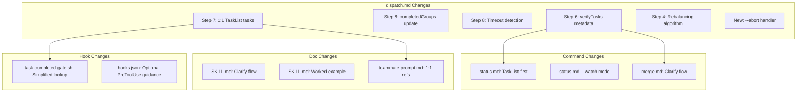

# Design: parallel-v2

## Overview

Targeted fixes to 6 existing plugin files. Core architectural change: dispatch creates 1:1 TaskList-to-spec-task mapping instead of group-level tasks. All other improvements build on or are independent of this change.

## Architecture



## Components

### Component 1: 1:1 TaskList Mapping (P0-1)
**Purpose**: Replace group-level TaskList tasks with individual spec-task entries
**Files**: `commands/dispatch.md`, `hooks/scripts/task-completed-gate.sh`, `templates/teammate-prompt.md`

**Current behavior** (dispatch.md Step 7):
```
TaskList task: "Group 1: api-layer (tasks 1.1, 1.2, 1.4)"
```

**New behavior**:
```
TaskList task #1: "1.1: Add auth endpoint"         owner: api-layer
TaskList task #2: "1.2: Add middleware"              owner: api-layer
TaskList task #3: "1.4: Add error handling"          owner: api-layer
TaskList task #4: "1.3: Create login form"           owner: ui-components
```

**Impact on task-completed-gate.sh**:
- Current: lines 84-100 use regex to extract spec task ID from subject/description
- New: task_subject starts with spec task ID (e.g., "1.1: ..."), parse with `echo "$TASK_SUBJECT" | grep -oE '^[0-9]+\.[0-9]+'`
- Eliminates the fragile multi-ID extraction logic entirely

**Impact on teammate prompt**:
- Current: "Claim task #$taskListId" (single group-level task)
- New: "Your TaskList tasks: #1 (1.1), #2 (1.2), #4 (1.4). Claim each as you start it."

### Component 2: completedGroups Tracking (P0-2)
**Purpose**: Keep dispatch-state.json accurate during execution
**Files**: `commands/dispatch.md`

**Design**: Add to dispatch.md Step 8 lead coordination loop:
```
After receiving completion message from teammate:
1. Check TaskList: are ALL tasks owned by this group completed?
2. If yes: add group name to completedGroups in .dispatch-state.json
3. Write updated state file
```

### Component 3: Stall/Timeout Handling (P0-3)
**Purpose**: Prevent lead from waiting forever on stuck teammates
**Files**: `commands/dispatch.md`

**Design**: Add timeout guidance to Step 8:
```
STALL DETECTION:
- After spawning teammates, track time since last teammate message
- If no message received for 10 minutes from any teammate:
  1. Check TaskList for that teammate's task statuses
  2. Send message: "Status check — are you blocked on anything?"
  3. Wait 5 more minutes
  4. If still no response: Mark teammate as stalled
     - Option A: Reassign remaining tasks to self or another teammate
     - Option B: Shut down teammate, handle tasks as serial
  5. Log stall event in .dispatch-state.json
```

### Component 4: Phase-Aware verifyTasks (P0-4)
**Purpose**: Lead knows which verify to run at each phase gate
**Files**: `commands/dispatch.md`, `commands/status.md`, `commands/merge.md`

**Schema change**:
```json
// OLD
"verifyTasks": ["1.8", "2.4"]

// NEW
"verifyTasks": [
  {"id": "1.8", "phase": 1, "description": "Phase 1 verify checkpoint"},
  {"id": "2.4", "phase": 2, "description": "Phase 2 verify checkpoint"}
]
```

**Backward compat**: status.md and merge.md check if array element is string or object:
```
If typeof element === "string": treat as {id: element, phase: unknown}
If typeof element === "object": use id and phase fields
```

### Component 5: TaskList-Based Status (P0-5)
**Purpose**: Accurate real-time progress from TaskList instead of git log heuristics
**Files**: `commands/status.md`

**Design**: Rewrite Step 2:
```
1. PRIMARY: Use TaskList to get all task statuses
   - For each task: check status (pending/in_progress/completed)
   - Group by owner (= group name) for per-group progress
   - This is authoritative — no guessing

2. SECONDARY: Git log for supplementary info
   - Recent commit messages for "Current activity" display
   - Only used for the "Current:" line in status output
```

### Component 6: Merge Flow Clarification (P1-6)
**Purpose**: Remove confusion about when /merge is needed
**Files**: `commands/dispatch.md`, `commands/merge.md`, `skills/parallel-workflow/SKILL.md`

**Changes**:
- dispatch.md Step 8 cleanup: add note "For file-ownership strategy, dispatch handles full lifecycle. No /merge needed."
- merge.md intro: add "Note: For file-ownership strategy, merge is optional (consistency check only). It is required for worktree strategy."
- SKILL.md workflow: change step 5 to "5. Integrate results: /ralph-parallel:merge (worktree strategy only; file-ownership completes in dispatch)"

### Component 7: Dispatch Abort (P1-7)
**Purpose**: Clean abort path for failed/unwanted dispatches
**Files**: `commands/dispatch.md`

**Design**: Add new section after Step 8:
```
## Abort Handler

When --abort flag is present:

1. Read .dispatch-state.json — error if not found or status != "dispatched"
2. Read team config to find active teammates
3. Send shutdown_request to each teammate via SendMessage
4. Wait for shutdown confirmations (timeout 30s)
5. Delete team via TeamDelete
6. Update .dispatch-state.json: status = "aborted"
7. Output: "Dispatch aborted. Team shut down. N tasks were incomplete."
```

### Component 8: Rebalancing Algorithm (P1-8)
**Purpose**: Define concrete rebalancing or remove the claim
**Files**: `commands/dispatch.md`

**Design**: Replace the vague "Try to redistribute" with a concrete algorithm:
```
BALANCE CHECK:
- Compute: maxTasks = max(group.tasks.length), minTasks = min(group.tasks.length)
- If maxTasks > 2 * minTasks:
  - For each task in the largest group (from last to first):
    - Check: does this task's files conflict with any file in the smallest group?
    - If no conflict: move task to smallest group, update fileOwnership
    - Recompute max/min after each move
    - Stop when maxTasks <= 2 * minTasks or no more moves possible
```

### Component 9: File Ownership Enforcement Hook (P2-9)
**Purpose**: Catch ownership violations at write time instead of post-hoc
**Files**: `hooks/hooks.json` (guidance only — add as commented documentation)

**Design**: Add documentation section to dispatch.md describing an optional PreToolUse:Write hook. Not enabled by default. The hook would:
1. Read the teammate's group from environment or dispatch-state
2. Check if the target file is in the group's ownedFiles
3. Block (exit 2) if not owned

Note: This is guidance only. Actual PreToolUse hooks may not be available in all Claude Code versions.

### Component 10: Status Watch Mode (P2-10)
**Purpose**: Live monitoring without re-running command
**Files**: `commands/status.md`

**Design**: Add `--watch` flag handling:
```
If --watch flag:
1. Run normal status display
2. Wait 30 seconds
3. Re-run status check
4. Display updated status (clear previous)
5. Repeat until user interrupts (Ctrl+C) or all tasks complete
```

Implementation note: Since commands are markdown instructions for Claude, "watch" means the lead should re-run the status check periodically. Add instruction: "Re-check TaskList every 30 seconds and display updated status. Stop when all tasks are completed or user says to stop."

### Component 11: Worked Example (P2-11)
**Purpose**: Concrete demonstration of full dispatch workflow
**Files**: `skills/parallel-workflow/SKILL.md`

**Design**: Add "## Worked Example" section showing:
- A simple 3-task spec with 2 groups
- Partition plan output
- Teammate spawn and completion flow
- Final status output

## Data Flow

1. User runs `/ralph-parallel:dispatch`
2. dispatch.md parses tasks.md, builds dependency graph, partitions into groups
3. dispatch.md writes .dispatch-state.json (with new verifyTasks format)
4. dispatch.md creates team, spawns teammates with individual TaskList tasks
5. Teammates claim individual tasks, execute, mark complete
6. task-completed-gate.sh fires on each TaskList completion, extracts spec task ID from subject
7. Lead monitors via TaskList, updates completedGroups, handles timeouts
8. Lead runs verify checkpoints at phase gates
9. User can check progress via `/ralph-parallel:status` (reads TaskList)
10. User can abort via `/ralph-parallel:dispatch --abort`

## Technical Decisions

| Decision | Options | Choice | Rationale |
|----------|---------|--------|-----------|
| TaskList granularity | Per-group vs per-task | Per-task | Eliminates regex extraction, enables per-task status tracking |
| verifyTasks format | Flat array vs objects | Objects with phase | Enables phase-gate logic without re-parsing tasks.md |
| Rebalancing | Define vs remove | Define simple algorithm | Users expect it to work since it's mentioned |
| File enforcement | Hook vs post-hoc | Guidance only (not default) | PreToolUse availability uncertain, don't break existing flow |
| Status source | Git log vs TaskList | TaskList primary, git secondary | TaskList is authoritative for agent task status |

## File Structure

| File | Action | Purpose |
|------|--------|---------|
| `commands/dispatch.md` | Modify | Steps 4,6,7,8 + abort handler |
| `commands/status.md` | Modify | TaskList-first, --watch mode |
| `commands/merge.md` | Modify | Clarify flow, handle new verifyTasks format |
| `hooks/scripts/task-completed-gate.sh` | Modify | Simplify spec task ID extraction |
| `skills/parallel-workflow/SKILL.md` | Modify | Clarify flow, add worked example |
| `templates/teammate-prompt.md` | Modify | 1:1 task references |

## Error Handling

| Error | Handling | User Impact |
|-------|----------|-------------|
| Teammate stall (10min) | Message check, then reassign or serialize | Brief delay, auto-recovery |
| Abort with active team | Graceful shutdown_request to all | Clean teardown |
| Old dispatch-state format | Status/merge detect string vs object in verifyTasks | Transparent compat |
| --abort with no dispatch | Error message | "No active dispatch to abort" |

## Existing Patterns to Follow
- Command markdown uses `## Step N:` structure with nested code blocks for instructions (dispatch.md)
- Hook scripts use `set -euo pipefail`, jq for JSON, exit 0/2 pattern (task-completed-gate.sh)
- State files use JSON in specs/$specName/ directory (dispatch-state.json)
- Error tables at end of command files (`| Error | Action |`)
