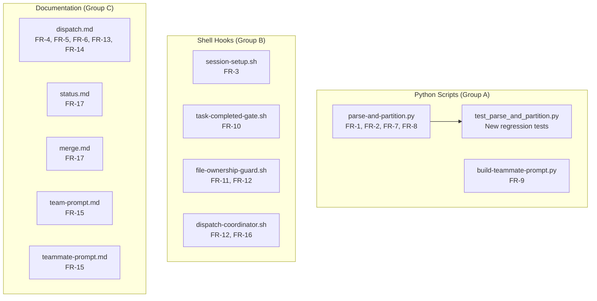
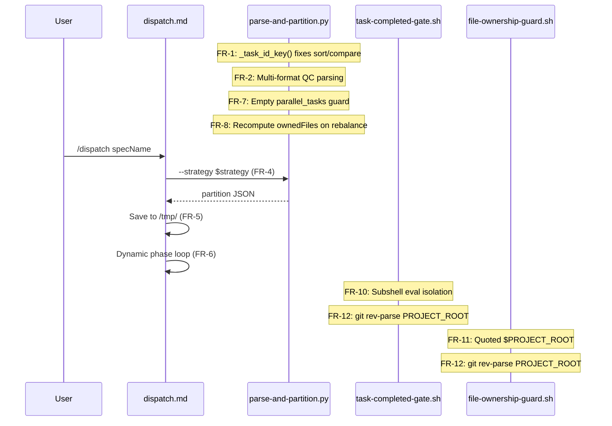

# Design: Plugin Audit Fixes

## Overview

17 surgical fixes across 11 files in ralph-parallel plugin. No architectural changes -- all fixes are localized edits (1-20 lines each). Grouped by file to minimize merge conflicts when dispatched in parallel: Python group (4 code fixes + tests), Shell group (4 hook fixes), Documentation group (9 prose/template fixes).

## Architecture



## Components

### Group A: Python Script Fixes

#### FR-1: Numeric Task ID Comparison (`parse-and-partition.py`)

**Add helper** (insert after line 24, before imports end):

```python
def _task_id_key(task_id: str) -> tuple[int, int]:
    """Convert 'X.Y' to (X, Y) for correct numeric comparison."""
    parts = task_id.split('.')
    return (int(parts[0]), int(parts[1]))
```

**Location**: Place after the `from pathlib import Path` import block, before the `WEAK_PATTERNS` line (around line 36). This keeps utility functions near the top.

**4 call sites to update**:

| Line | Current | Replacement |
|------|---------|-------------|
| 440 | `other['id'] < t['id']` | `_task_id_key(other['id']) < _task_id_key(t['id'])` |
| 445 | `other['id'] > t['id']` | `_task_id_key(other['id']) > _task_id_key(t['id'])` |
| 611 | `key=lambda t: (t['phase'], t['id'])` | `key=lambda t: (t['phase'], _task_id_key(t['id']))` |
| 628 | `key=lambda t: (t['phase'], t['id'])` | `key=lambda t: (t['phase'], _task_id_key(t['id']))` |

#### FR-2: Quality Commands Parser (`parse-and-partition.py`)

**Replace** `parse_quality_commands_from_tasks()` (lines 124-167) with multi-format parser:

```python
def parse_quality_commands_from_tasks(content: str) -> dict:
    """Parse Quality Commands section from tasks.md content.

    Supports three formats (checked in priority order):
    1. Bold markdown: - **Build**: `cmd`
    2. Code-fenced:   ```\nbuild: cmd\n```
    3. Bare dash:     - Build: cmd

    Returns dict with slots as keys and commands as values.
    This is the PRIMARY source -- auto-discovery is fallback only.
    """
    result = {}
    valid_slots = {"typecheck", "build", "test", "lint", "dev"}
    in_section = False
    in_code_block = False

    for line in content.split('\n'):
        # Detect the Quality Commands heading
        if re.match(r'^##\s+Quality\s+Commands', line, re.IGNORECASE):
            in_section = True
            continue

        # Stop at next heading
        if in_section and re.match(r'^##\s+', line) and not re.match(r'^##\s+Quality', line, re.IGNORECASE):
            break

        if not in_section:
            continue

        # Track code fence
        if line.strip().startswith('```'):
            in_code_block = not in_code_block
            continue

        if in_code_block:
            # Parse "slot: command" lines inside code fence
            m = re.match(r'^(\w+):\s*(.+)', line.strip())
            if m:
                slot = m.group(1).lower()
                cmd = m.group(2).strip()
                if slot in valid_slots and cmd:
                    result[slot] = cmd
            continue

        # Bold markdown: - **Build**: `cmd` or **Build**: `cmd`
        stripped = line.strip()
        m = re.match(r'^[-*]?\s*\*\*(\w+)\*\*:\s*`([^`]+)`', stripped)
        if m:
            slot = m.group(1).lower()
            cmd = m.group(2).strip()
            if slot in valid_slots and cmd and cmd.upper() != 'N/A':
                result[slot] = cmd
            continue

        # Bold markdown with N/A (no backticks): - **Build**: N/A
        m = re.match(r'^[-*]?\s*\*\*(\w+)\*\*:\s*N/?A\b', stripped, re.IGNORECASE)
        if m:
            continue  # Explicitly skip N/A entries

        # Bare dash: - Build: `cmd` or - Build: cmd
        m = re.match(r'^-\s+(\w+):\s*`?([^`]+)`?\s*$', stripped)
        if m:
            slot = m.group(1).lower()
            cmd = m.group(2).strip()
            if slot in valid_slots and cmd and cmd.upper() != 'N/A':
                result[slot] = cmd

    return result
```

**Key design decisions**:
- Bold markdown checked outside code fence (primary format)
- Code-fenced parsing retained inside code fence (backward compat)
- Bare dash as fallback (handles quality-gates-v2 format)
- `N/A` values explicitly excluded from all formats (AC-2.5)

#### FR-7: Worktree Empty Guard (`parse-and-partition.py`)

**Insert at line 611** (top of `_build_groups_worktree`):

```python
def _build_groups_worktree(parallel_tasks, max_teammates):
    """..."""
    if not parallel_tasks:
        return [], []

    parallel_tasks.sort(key=lambda t: (t['phase'], _task_id_key(t['id'])))
    # ... rest unchanged
```

#### FR-8: Rebalance Fix (`parse-and-partition.py`)

**Replace lines 696-697** in `_rebalance_groups`:

```python
# Before (WRONG):
groups[largest]['tasks'].pop(t_idx)
groups[largest]['ownedFiles'] -= task_files

# After (CORRECT):
groups[largest]['tasks'].pop(t_idx)
# Recompute ownedFiles from remaining tasks (other tasks may share files)
remaining_files = set()
for remaining_task in groups[largest]['tasks']:
    remaining_files.update(remaining_task['files'])
groups[largest]['ownedFiles'] = remaining_files
```

#### FR-9: Commit Provenance (`build-teammate-prompt.py`)

**Replace line 180**:

```python
# Before:
lines.append('Use `git commit -s` flag or manually append the trailer to every commit.')

# After:
lines.append('Append the Signed-off-by trailer manually to every commit message.')
lines.append('Do NOT use `git commit -s` -- it produces the wrong format for provenance tracking.')
```

### Group B: Shell Hook Fixes

#### FR-3: Export Session ID (`session-setup.sh`)

**Replace line 19**:

```bash
# Before:
echo "CLAUDE_SESSION_ID=$SESSION_ID" >> "$CLAUDE_ENV_FILE" 2>/dev/null || true

# After:
echo "export CLAUDE_SESSION_ID=$SESSION_ID" >> "$CLAUDE_ENV_FILE" 2>/dev/null || true
```

#### FR-10: Eval Isolation (`task-completed-gate.sh`)

**Replace lines 115-120**:

```bash
# Before:
cd "$PROJECT_ROOT"

# --- Stage 1: Verify command with output capture ---
echo "ralph-parallel: Verifying task $COMPLETED_SPEC_TASK: $VERIFY_CMD" >&2

VERIFY_OUTPUT=$(eval "$VERIFY_CMD" 2>&1) && VERIFY_EXIT=0 || VERIFY_EXIT=$?

# After:
# --- Stage 1: Verify command with output capture ---
echo "ralph-parallel: Verifying task $COMPLETED_SPEC_TASK: $VERIFY_CMD" >&2

VERIFY_OUTPUT=$(cd "$PROJECT_ROOT" && eval "$VERIFY_CMD" 2>&1) && VERIFY_EXIT=0 || VERIFY_EXIT=$?
```

Also wrap supplemental eval calls in subshells (Stages 2, 4, 5, 6):

| Stage | Line | Change |
|-------|------|--------|
| 2 (typecheck) | 136 | `TC_OUTPUT=$(cd "$PROJECT_ROOT" && eval "$TYPECHECK_CMD" 2>&1)` |
| 4 (build) | 189 | `BUILD_OUTPUT=$(cd "$PROJECT_ROOT" && eval "$BUILD_CMD" 2>&1)` |
| 5 (test) | 243 | `TEST_OUTPUT=$(cd "$PROJECT_ROOT" && eval "$TEST_CMD" 2>&1)` |
| 6 (lint) | 303 | `LINT_OUTPUT=$(cd "$PROJECT_ROOT" && eval "$LINT_CMD" 2>&1)` |

Remove the standalone `cd "$PROJECT_ROOT"` at line 115 entirely.

#### FR-11: Quote PROJECT_ROOT (`file-ownership-guard.sh`)

**Replace line 82**:

```bash
# Before:
REL_PATH="${FILE_PATH#$PROJECT_ROOT/}"

# After:
REL_PATH="${FILE_PATH#"$PROJECT_ROOT"/}"
```

#### FR-12: Standardize PROJECT_ROOT (3 hooks)

**file-ownership-guard.sh** -- replace lines 39-44:

```bash
# Before:
CWD=$(echo "$INPUT" | jq -r '.cwd // empty' 2>/dev/null) || CWD=""
if [ -n "$CWD" ]; then
  PROJECT_ROOT="$CWD"
else
  PROJECT_ROOT=$(git rev-parse --show-toplevel 2>/dev/null) || exit 0
fi

# After:
PROJECT_ROOT=$(git rev-parse --show-toplevel 2>/dev/null) || {
  CWD=$(echo "$INPUT" | jq -r '.cwd // empty' 2>/dev/null) || CWD=""
  PROJECT_ROOT="${CWD:-$(pwd)}"
}
```

**task-completed-gate.sh** -- replace lines 33-37:

```bash
# Before:
if [ -n "$CWD" ]; then
  PROJECT_ROOT="$CWD"
else
  PROJECT_ROOT=$(git rev-parse --show-toplevel 2>/dev/null) || exit 0
fi

# After:
PROJECT_ROOT=$(git rev-parse --show-toplevel 2>/dev/null) || PROJECT_ROOT="${CWD:-$(pwd)}"
```

**dispatch-coordinator.sh** -- replace lines 29-33:

```bash
# Before:
if [ -n "$CWD" ]; then
  PROJECT_ROOT="$CWD"
else
  PROJECT_ROOT=$(git rev-parse --show-toplevel 2>/dev/null) || exit 0
fi

# After:
PROJECT_ROOT=$(git rev-parse --show-toplevel 2>/dev/null) || PROJECT_ROOT="${CWD:-$(pwd)}"
```

#### FR-16: Stop Hook Re-injection (`dispatch-coordinator.sh`)

**Replace lines 191-195** (the NEXT ACTIONS block):

```
NEXT ACTIONS:
1. Check TaskList for teammate progress
2. If waiting for teammates: they may be idle -- check and send status messages
3. When all Phase N tasks done: run the verify checkpoint yourself
4. When all tasks done: run mark-tasks-complete.py, set status="merged", shut down teammates, TeamDelete
```

### Group C: Documentation Fixes

#### FR-4: Strategy Flag (`dispatch.md`)

**Replace lines 82-87** (Step 3 command):

```bash
python3 ${CLAUDE_PLUGIN_ROOT}/scripts/parse-and-partition.py \
  --tasks-md specs/$specName/tasks.md \
  --max-teammates $maxTeammates \
  --strategy $strategy \
  --format
```

#### FR-5: Partition File Save (`dispatch.md`)

**Insert after Step 2 success case** (after line 69, the "Save to a variable" text):

Add to Step 2 exit code 0 handling:

```text
- 0: Success -- JSON partition on stdout. Save to a variable AND save to /tmp/$specName-partition.json for use by build-teammate-prompt.py in Step 6.
```

#### FR-6: Dynamic Phase References (`dispatch.md`)

**Replace lines 235-237** (Step 7 items 5-6):

```text
5. SERIAL TASKS: After ALL parallel groups complete (all phases), execute serial tasks yourself

6. FINAL VERIFY: Run the last phase's verify checkpoint
```

#### FR-13: Stall Recovery (`dispatch.md`)

**Replace line 223** (Step 7 item 3c):

```text
c. If still no response: re-spawn the stalled teammate with remaining tasks.
   If re-spawn fails, serialize remaining tasks and warn user.
```

#### FR-14: Allowed-Tools (`dispatch.md`)

**Replace line 4**:

```yaml
allowed-tools: [Read, Write, Edit, Bash, Task, AskUserQuestion, Glob, Grep, SendMessage, TeamCreate, TeamDelete]
```

#### FR-15: Step References (templates)

**team-prompt.md line 2**: `Step 8` -> `Step 7`

**teammate-prompt.md line 2**: `Step 7` -> `Step 6`

**teammate-prompt.md line 39**: `Step 7` -> `Step 5`

#### FR-17: Stale Handling (`status.md` and `merge.md`)

**status.md** -- insert in Step 1 after line 26 (status resolution):

```text
   - If status "stale": Display stale notice:
     "Dispatch STALE for '$specName' (reason: $staleReason, since: $staleSince)."
     "Run /ralph-parallel:dispatch to re-dispatch, or /ralph-parallel:dispatch --abort to cancel."
     Include staleSince, staleReason from dispatch state. Skip Steps 2-3 (no live team to query).
```

**merge.md** -- insert in Step 1 after line 31 (status validation):

```text
   - "stale" -> "This dispatch is stale (team lost at $staleSince). Run /ralph-parallel:dispatch to re-dispatch or /ralph-parallel:dispatch --abort to cancel."
```

## Data Flow



## Technical Decisions

| Decision | Options Considered | Choice | Rationale |
|----------|-------------------|--------|-----------|
| QC parser format | Bold-only, Code-fence-only, Multi-format | Multi-format | Backward compat for existing specs using code-fenced format |
| eval isolation | Subshell `$()`, pushd/popd | Subshell via `$()` | Also isolates env var mutations, not just CWD |
| PROJECT_ROOT | CWD-first, git-first, env-var | git-first + CWD fallback | Matches session-setup.sh pattern; CWD may be subdirectory |
| _task_id_key location | Module-level function, inline lambda | Module-level function | Used at 4 call sites; testable independently |
| N/A handling in QC | Ignore silently, Warn, Error | Ignore silently | N/A is intentional "not applicable" -- not an error |
| Rebalance ownedFiles | Remove only task's unique files, Recompute from remaining | Recompute from remaining | Simpler, correct, O(tasks*files) is negligible |

## File Structure

| File | Action | FRs | Lines Changed |
|------|--------|-----|---------------|
| `ralph-parallel/scripts/parse-and-partition.py` | Modify | FR-1, FR-2, FR-7, FR-8 | ~60 |
| `ralph-parallel/scripts/build-teammate-prompt.py` | Modify | FR-9 | 2 |
| `ralph-parallel/scripts/test_parse_and_partition.py` | Modify | NFR-1 | ~80 (new tests) |
| `ralph-parallel/hooks/scripts/session-setup.sh` | Modify | FR-3 | 1 |
| `ralph-parallel/hooks/scripts/task-completed-gate.sh` | Modify | FR-10, FR-12 | ~10 |
| `ralph-parallel/hooks/scripts/file-ownership-guard.sh` | Modify | FR-11, FR-12 | ~6 |
| `ralph-parallel/hooks/scripts/dispatch-coordinator.sh` | Modify | FR-12, FR-16 | ~8 |
| `ralph-parallel/commands/dispatch.md` | Modify | FR-4, FR-5, FR-6, FR-13, FR-14 | ~15 |
| `ralph-parallel/commands/status.md` | Modify | FR-17 | ~5 |
| `ralph-parallel/commands/merge.md` | Modify | FR-17 | ~3 |
| `ralph-parallel/templates/team-prompt.md` | Modify | FR-15 | 1 |
| `ralph-parallel/templates/teammate-prompt.md` | Modify | FR-15 | 2 |

## Error Handling

| Error Scenario | Handling Strategy | User Impact |
|----------------|-------------------|-------------|
| _task_id_key with malformed ID | int() raises ValueError | Parse fails early with clear traceback (existing behavior for malformed tasks.md) |
| QC section has no parseable lines | Returns empty dict -> falls through to auto-discovery | No change from current behavior |
| git rev-parse fails (not in repo) | Falls back to CWD from input JSON | Hooks work in non-git environments |
| Empty parallel_tasks in worktree | Returns ([], []) immediately | partition_tasks exits with code 4 ("no parallel groups") |
| Rebalance with all files overlapping | No movable task found -> loop breaks | Imbalanced groups preserved (existing behavior) |

## Edge Cases

- **Task ID "1.10"**: Sorts after "1.9" with _task_id_key, before "1.2" without it. Core fix.
- **QC section with mixed formats**: Bold markdown line followed by code-fenced block. Both parsed correctly -- code-fence only active inside fence markers.
- **N/A with various casings**: `N/A`, `n/a`, `N/a` all handled by `re.IGNORECASE` on the N/A pattern and `.upper() != 'N/A'` checks.
- **PROJECT_ROOT with spaces**: Quoting fix (FR-11) handles paths like `/Users/My Name/project`.
- **All-VERIFY task list**: Guard returns ([], []) -> `partition_tasks` gets 0 groups -> exit code 4 with clear message.
- **Rebalance with shared files**: After moving task from group A to B, A's ownedFiles recomputed from remaining tasks. Files used by multiple remaining tasks stay in the set.
- **Subshell eval with exit codes**: `$(cd ... && eval ...)` captures exit code correctly via `&& EXIT=0 || EXIT=$?` pattern.

## Test Strategy

### New Regression Tests (in `test_parse_and_partition.py`)

```python
class TestTaskIdKey:
    """FR-1: Numeric task ID comparison."""

    def test_basic_comparison(self):
        assert _task_id_key("1.10") > _task_id_key("1.2")
        assert _task_id_key("1.1") < _task_id_key("1.2")
        assert _task_id_key("2.1") > _task_id_key("1.9")

    def test_sort_order(self):
        ids = ["1.1", "1.10", "1.11", "1.2", "1.9", "2.1"]
        sorted_ids = sorted(ids, key=_task_id_key)
        assert sorted_ids == ["1.1", "1.2", "1.9", "1.10", "1.11", "2.1"]

    def test_verify_dependency_ordering(self):
        """12-task phase with VERIFY -- dependencies use numeric comparison."""
        tasks_md = generate_12_task_tasks_md()  # helper
        tasks = parse_tasks(tasks_md)
        tasks = build_dependency_graph(tasks)
        verify = [t for t in tasks if 'VERIFY' in t['markers']][0]
        # All 11 non-VERIFY tasks should be dependencies
        assert len(verify['dependencies']) == 11


class TestQualityCommandsParsing:
    """FR-2: Multi-format QC parsing."""

    def test_bold_markdown_format(self):
        content = """## Quality Commands
- **Build**: `cargo build`
- **Test**: `cargo test`
- **Lint**: `cargo clippy`
"""
        result = parse_quality_commands_from_tasks(content)
        assert result == {"build": "cargo build", "test": "cargo test", "lint": "cargo clippy"}

    def test_code_fenced_format(self):
        content = """## Quality Commands
```
build: cargo build
test: cargo test
```
"""
        result = parse_quality_commands_from_tasks(content)
        assert result == {"build": "cargo build", "test": "cargo test"}

    def test_bare_dash_format(self):
        content = """## Quality Commands
- Build: `cargo build`
- Test: cargo test
"""
        result = parse_quality_commands_from_tasks(content)
        assert result["build"] == "cargo build"
        assert result["test"] == "cargo test"

    def test_na_excluded(self):
        content = """## Quality Commands
- **Build**: N/A
- **Test**: `cargo test`
"""
        result = parse_quality_commands_from_tasks(content)
        assert "build" not in result
        assert result["test"] == "cargo test"

    def test_bold_markdown_without_dash(self):
        content = """## Quality Commands
**Build**: `make build`
**Test**: `make test`
"""
        result = parse_quality_commands_from_tasks(content)
        assert result == {"build": "make build", "test": "make test"}


class TestWorktreeEmptyGuard:
    """FR-7: Empty parallel_tasks guard."""

    def test_all_verify_tasks(self):
        tasks_md = """## Phase 1
- [ ] 1.1 [VERIFY] Check everything
  - **Verify**: `cargo test`
"""
        tasks = parse_tasks(tasks_md)
        tasks = build_dependency_graph(tasks)
        result = partition_tasks(tasks, max_teammates=4, strategy='worktree')
        # Should not crash; result is None (all incomplete are VERIFY)
        # or has 0 groups


class TestRebalanceOwnership:
    """FR-8: Rebalance preserves file ownership."""

    def test_shared_files_preserved(self):
        """After rebalance, files used by remaining tasks stay in ownedFiles."""
        # Create tasks where group gets imbalanced, files overlap
        tasks_md = """## Phase 1
- [ ] 1.1 [P] Task A
  - **Files**: `shared.ts`, `a.ts`
- [ ] 1.2 [P] Task B
  - **Files**: `shared.ts`, `b.ts`
- [ ] 1.3 [P] Task C
  - **Files**: `c.ts`
- [ ] 1.4 [P] Task D
  - **Files**: `d.ts`
- [ ] 1.5 [P] Task E
  - **Files**: `e.ts`
"""
        tasks = parse_tasks(tasks_md)
        tasks = build_dependency_graph(tasks)
        result = partition_tasks(tasks, max_teammates=2, strategy='file-ownership')
        # Verify no group lost ownership of files its tasks still reference
        for g in result['groups']:
            owned = set(g['ownedFiles'])
            for task_id in g['tasks']:
                task = next(t for t in tasks if t['id'] == task_id)
                for f in task['files']:
                    assert f in owned, \
                        f"Task {task_id} needs {f} but group doesn't own it"
```

### Existing Tests (must still pass)

```bash
python3 ralph-parallel/scripts/test_parse_and_partition.py
python3 ralph-parallel/scripts/test_build_teammate_prompt.py
python3 ralph-parallel/scripts/test_mark_tasks_complete.py
python3 ralph-parallel/scripts/test_verify_commit_provenance.py
```

### Shell Script Verification (manual/scripted)

| Fix | Verification |
|-----|-------------|
| FR-3 (export) | `grep 'export CLAUDE_SESSION_ID' session-setup.sh` |
| FR-10 (subshell) | Run hook with verify cmd that does `cd /tmp && pwd`; confirm Stage 2 runs from PROJECT_ROOT |
| FR-11 (quoting) | Static analysis -- quoted `"$PROJECT_ROOT"` in parameter expansion |
| FR-12 (git rev-parse) | `grep 'git rev-parse --show-toplevel' *.sh` confirms all 4 hooks use same pattern |

## Performance Considerations

- `_task_id_key()` adds negligible overhead: 2 string splits + 2 int conversions per call, max ~100 calls for large specs
- Subshell eval creates a subprocess per eval call -- already the case (eval spawns processes). No additional overhead.
- Rebalance recomputing ownedFiles iterates remaining tasks * files. Worst case ~50 tasks * 10 files = 500 ops. Negligible.

## Security Considerations

- FR-11 (quoting) prevents potential glob injection in PROJECT_ROOT path
- FR-10 (subshell) prevents eval side effects from leaking between stages
- No new external inputs or untrusted data flows introduced

## Existing Patterns to Follow

Based on codebase analysis:
- Test file imports module via `importlib.util.spec_from_file_location` (hyphenated filename)
- Tests use `pytest` classes with `self._make_task()` helpers and `tmp_path` fixture
- Shell hooks use `set -euo pipefail` and read JSON from stdin via `$(cat)` + `jq`
- PROJECT_ROOT derivation should use `git rev-parse --show-toplevel` (session-setup.sh is the reference)
- dispatch.md uses `$CLAUDE_PLUGIN_ROOT` for script paths
- Commit convention: `Signed-off-by: group-name` trailer (not git commit -s format)

## Implementation Steps

1. **FR-1**: Add `_task_id_key()` helper to `parse-and-partition.py`, update 4 call sites (lines 440, 445, 611, 628)
2. **FR-2**: Replace `parse_quality_commands_from_tasks()` with multi-format parser (lines 124-167)
3. **FR-7**: Add empty guard to `_build_groups_worktree` (line 611)
4. **FR-8**: Fix `_rebalance_groups` to recompute ownedFiles (lines 696-697)
5. **Add regression tests** for FR-1, FR-2, FR-7, FR-8 in `test_parse_and_partition.py`
6. **FR-9**: Remove `-s` advice in `build-teammate-prompt.py` (line 180)
7. **FR-3**: Add `export` keyword in `session-setup.sh` (line 19)
8. **FR-10**: Wrap eval calls in subshells in `task-completed-gate.sh` (lines 115-120, 136, 189, 243, 303)
9. **FR-11**: Quote `$PROJECT_ROOT` in `file-ownership-guard.sh` (line 82)
10. **FR-12**: Standardize PROJECT_ROOT in 3 hooks (file-ownership-guard.sh:39-44, task-completed-gate.sh:33-37, dispatch-coordinator.sh:29-33)
11. **FR-16**: Add mark-tasks-complete to stop hook re-injection (dispatch-coordinator.sh:191-195)
12. **FR-4**: Add `--strategy $strategy` to dispatch.md Step 3 (lines 82-87)
13. **FR-5**: Add partition JSON save step to dispatch.md Step 2 (line 69)
14. **FR-6**: Replace "Phase 2" with dynamic references in dispatch.md Step 7 (lines 235-237)
15. **FR-13**: Replace "reassign to self" in dispatch.md Step 7.3c (line 223)
16. **FR-14**: Add SendMessage, TeamCreate, TeamDelete to dispatch.md allowed-tools (line 4)
17. **FR-15**: Fix step references in team-prompt.md (line 2) and teammate-prompt.md (lines 2, 39)
18. **FR-17**: Add stale handling to status.md and merge.md
19. **Run all existing tests** to confirm no regressions

## Dispatch Grouping for Parallel Execution

| Group | Name | Files | FRs | Task Count |
|-------|------|-------|-----|------------|
| A | python-fixes | parse-and-partition.py, build-teammate-prompt.py, test_parse_and_partition.py | FR-1,2,7,8,9 + tests | ~10 |
| B | shell-fixes | session-setup.sh, task-completed-gate.sh, file-ownership-guard.sh, dispatch-coordinator.sh | FR-3,10,11,12,16 | ~7 |
| C | doc-fixes | dispatch.md, status.md, merge.md, team-prompt.md, teammate-prompt.md | FR-4,5,6,13,14,15,17 | ~8 |

No file conflicts between groups. All three can execute in parallel.

## Risk Mitigations

| Risk | Mitigation |
|------|-----------|
| QC format change breaks existing specs | Multi-format parser supports all 3 known formats; regression test each |
| Rebalance fix changes partition output | Regression test with known input/output; only affects edge case (shared files + imbalance) |
| PROJECT_ROOT change in non-git env | CWD fallback preserved; git rev-parse failure handled gracefully |
| eval subshell masks exit codes | Existing `&& EXIT=0 \|\| EXIT=$?` pattern captures exit code from subshell |
| Stop hook text changes cause compaction issues | Keep re-injection text concise (single line change) |
