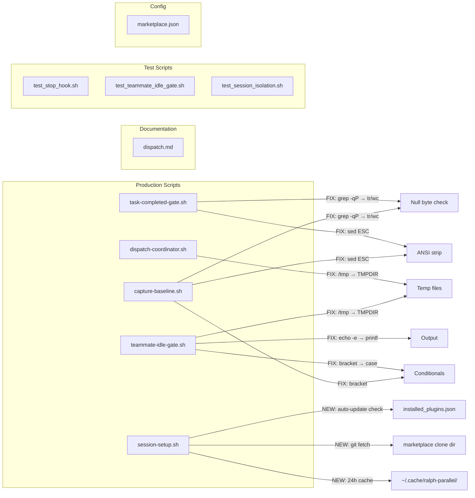
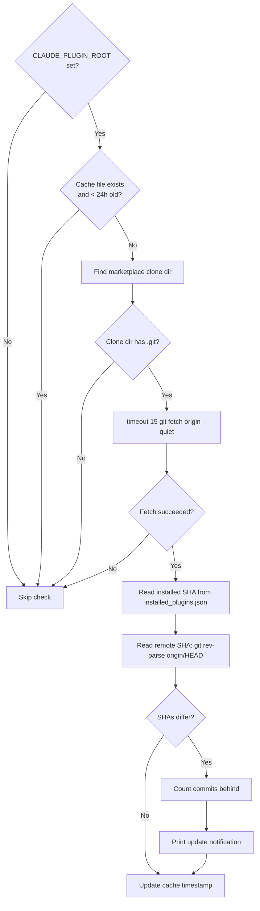
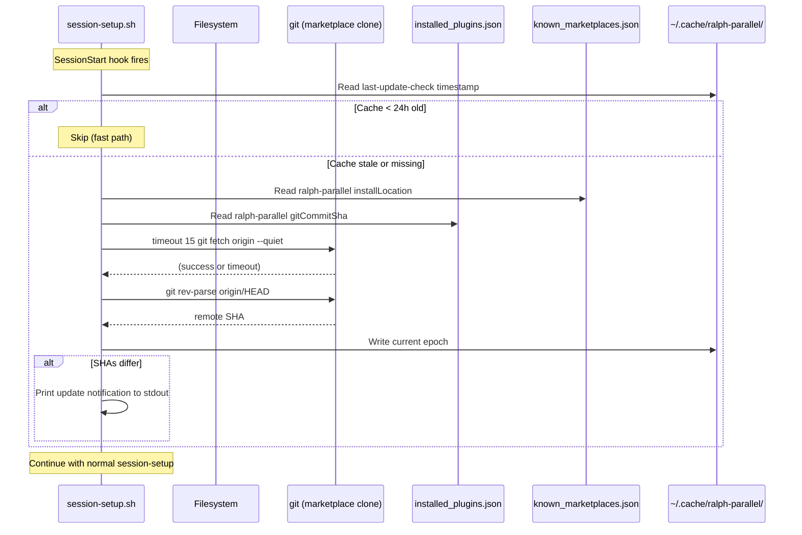

# Design: Portability Fixes and Auto-Update

## Overview

Seven targeted fixes across 10 files: a security-critical `grep -qP` replacement, `${TMPDIR:-/tmp}` adoption, version sync, three POSIX portability improvements, and a git-fetch-based auto-update notification with 24-hour cache. All changes are localized substitutions with no architectural changes.

## Architecture



## Components

### C1: Null Byte Sanitizer Fix (SECURITY)

**Files**: `task-completed-gate.sh:17-35`, `capture-baseline.sh:19-34`

**Current** (broken on macOS):
```bash
if printf '%s' "$cmd" | grep -qP '\x00' 2>/dev/null; then
```

**Replacement**:
```bash
if [ "$(printf '%s' "$cmd" | wc -c)" != "$(printf '%s' "$cmd" | tr -d '\0' | wc -c)" ]; then
```

**Why `wc -c` comparison**: `tr -d '\0'` removes null bytes. If byte count differs, nulls were present. Works on BSD and GNU. The `printf '%s'` avoids trailing newline that `echo` would add.

**Note**: Both files have identical `_sanitize_cmd()` functions. Both must be updated identically to prevent drift (AC-1.4).

### C2: TMPDIR Adoption

**Pattern**: Each script defines a helper variable near the top (after `set -euo pipefail`):

```bash
_RALPH_TMP="${TMPDIR:-/tmp}"
```

Then uses `$_RALPH_TMP` everywhere `/tmp` appeared.

**dispatch-coordinator.sh** (1 code line + 2 comments):

| Line | Current | Replacement |
|------|---------|-------------|
| 46 | `This means /tmp permission denied` | `This means temp dir permission denied` |
| 75 | `if /tmp write fails` | `if temp dir write fails` |
| 219 | `COUNTER_FILE="/tmp/ralph-stop-..."` | `COUNTER_FILE="$_RALPH_TMP/ralph-stop-..."` |

Add `_RALPH_TMP="${TMPDIR:-/tmp}"` after line 15 (`set -euo pipefail`).

**teammate-idle-gate.sh** (1 code line):

| Line | Current | Replacement |
|------|---------|-------------|
| 92 | `COUNTER_FILE="/tmp/ralph-idle-..."` | `COUNTER_FILE="$_RALPH_TMP/ralph-idle-..."` |

Add `_RALPH_TMP="${TMPDIR:-/tmp}"` after line 12 (`set -euo pipefail`).

**dispatch.md** (4 locations): Use `${TMPDIR:-/tmp}` inline since this is documentation.

| Line | Current | Replacement |
|------|---------|-------------|
| 69 | `/tmp/$specName-partition.json` | `${TMPDIR:-/tmp}/$specName-partition.json` |
| 96 | `--partition-file /tmp/$specName-partition.json` | `--partition-file ${TMPDIR:-/tmp}/$specName-partition.json` |
| 136 | `--partition-file /tmp/$specName-partition.json` | `--partition-file ${TMPDIR:-/tmp}/$specName-partition.json` |
| 178 | `--partition-file /tmp/$specName-partition.json` | `--partition-file ${TMPDIR:-/tmp}/$specName-partition.json` |

**Test scripts**: Same `_RALPH_TMP` pattern. All hardcoded `/tmp/ralph-stop-*` and `/tmp/ralph-idle-*` paths replaced.

### C3: Version Sync

**File**: `.claude-plugin/marketplace.json:13`

**Change**: `"0.2.3"` -> `"0.2.4"`

One-line change. No other fields modified.

### C4: `[[ ]]` Replacement

**teammate-idle-gate.sh:71**:

Current:
```bash
if [ -z "$TEAM_NAME" ] || [[ "$TEAM_NAME" != *-parallel ]]; then
  exit 0
fi
```

Replacement:
```bash
if [ -z "$TEAM_NAME" ]; then
  exit 0
fi
case "$TEAM_NAME" in
  *-parallel) ;;
  *) exit 0 ;;
esac
```

**Rationale**: Splits into two checks because `[ ]` cannot do glob pattern matching. The `case` statement is the POSIX way to match globs.

**capture-baseline.sh:40**:

Current:
```bash
while [[ $# -gt 0 ]]; do
```

Replacement:
```bash
while [ $# -gt 0 ]; do
```

Trivial -- `[ $# -gt 0 ]` is identical behavior.

### C5: sed ANSI-C Quoting Replacement

**Files**: `task-completed-gate.sh:363`, `capture-baseline.sh:110`

**Pattern**: Define `ESC` variable before first use (not at file top -- avoid unnecessary work on early-exit paths).

**task-completed-gate.sh**: Insert `ESC=$(printf '\033')` before line 363 (inside the "Tests passed" branch, just before the sed call).

Current (line 363):
```bash
TEST_OUTPUT_CLEAN=$(printf '%s' "$TEST_OUTPUT" | sed $'s/\x1b\\[[0-9;]*m//g')
```

Replacement:
```bash
ESC=$(printf '\033')
TEST_OUTPUT_CLEAN=$(printf '%s' "$TEST_OUTPUT" | sed "s/${ESC}\[[0-9;]*m//g")
```

**capture-baseline.sh**: Insert `ESC=$(printf '\033')` before line 110.

Current (line 110):
```bash
TEST_OUTPUT=$(printf '%s' "$TEST_OUTPUT" | sed $'s/\x1b\\[[0-9;]*m//g')
```

Replacement:
```bash
ESC=$(printf '\033')
TEST_OUTPUT=$(printf '%s' "$TEST_OUTPUT" | sed "s/${ESC}\[[0-9;]*m//g")
```

### C6: `echo -e` Replacement

**File**: `teammate-idle-gate.sh:149`

Current:
```bash
echo -e "$UNCOMPLETED" >&2
```

Replacement:
```bash
printf '%b\n' "$UNCOMPLETED" >&2
```

`%b` interprets backslash escapes (like `\n`) the same way `echo -e` does.

### C7: Auto-Update Notification

**File**: `session-setup.sh` -- new block inserted after the dev-source rsync block (lines 26-37) and before stdin read (line 41).

**Design constraints**:
- Must not consume stdin (session-setup reads JSON from stdin at line 41)
- Must not block session start (all failures silent)
- Must respect `CLAUDE_PLUGIN_ROOT` being unset (dev mode)
- 15-second timeout on git fetch
- 24-hour cache to avoid repeated fetches

**Logic flow**:



**Implementation**:

```bash
# --- Auto-update check (marketplace installs only) ---
if [ -n "${CLAUDE_PLUGIN_ROOT:-}" ]; then
  _ralph_update_check() {
    local cache_dir="${XDG_CACHE_HOME:-$HOME/.cache}/ralph-parallel"
    local cache_file="$cache_dir/last-update-check"
    local now
    now=$(date +%s 2>/dev/null) || return 0

    # Skip if checked within 24 hours
    if [ -f "$cache_file" ]; then
      local last_check
      last_check=$(cat "$cache_file" 2>/dev/null) || last_check=0
      if [ $((now - last_check)) -lt 86400 ] 2>/dev/null; then
        return 0
      fi
    fi

    # Find marketplace clone directory
    local mktplace_dir
    mktplace_dir=$(jq -r '."ralph-parallel".installLocation // empty' \
      "$HOME/.claude/plugins/known_marketplaces.json" 2>/dev/null) || return 0
    [ -d "$mktplace_dir/.git" ] || return 0

    # Get installed commit SHA
    local installed_sha
    installed_sha=$(jq -r '.plugins."ralph-parallel@ralph-parallel"[0].gitCommitSha // empty' \
      "$HOME/.claude/plugins/installed_plugins.json" 2>/dev/null) || return 0
    [ -n "$installed_sha" ] || return 0

    # Fetch with timeout (15s)
    if ! timeout 15 git -C "$mktplace_dir" fetch origin --quiet 2>/dev/null; then
      return 0
    fi

    # Compare SHAs
    local remote_sha
    remote_sha=$(git -C "$mktplace_dir" rev-parse origin/HEAD 2>/dev/null) || return 0

    # Update cache timestamp regardless of result
    mkdir -p "$cache_dir" 2>/dev/null || true
    printf '%s' "$now" > "$cache_file" 2>/dev/null || true

    # Short SHA comparison (installed_plugins.json may store abbreviated SHA)
    local installed_short="${installed_sha:0:7}"
    local remote_short="${remote_sha:0:7}"
    if [ "$installed_short" = "$remote_short" ]; then
      return 0
    fi

    # Also try full SHA comparison
    if [ "$installed_sha" = "$remote_sha" ]; then
      return 0
    fi

    # Count commits behind
    local behind
    behind=$(git -C "$mktplace_dir" rev-list --count "${installed_sha}..origin/HEAD" 2>/dev/null) || behind="?"

    echo "ralph-parallel: Update available ($behind commits behind). Run: claude plugin update ralph-parallel@ralph-parallel"
  }
  _ralph_update_check 2>/dev/null || true
  unset -f _ralph_update_check
fi
```

**Key design decisions for auto-update**:

1. **Wrapped in function + `unset -f`**: Encapsulates all local variables. Cleanup prevents namespace pollution.

2. **Short SHA comparison**: `installed_plugins.json` may store abbreviated SHAs (e.g., `"2461d9c"`). Compare first 7 chars, then try full match.

3. **`timeout 15`**: macOS has `timeout` via coreutils or as a shell builtin. If `timeout` is missing, git fetch runs with git's own socket timeout (longer but still finite). Alternative: `GIT_HTTP_LOW_SPEED_TIME=15`.

4. **Cache file stores epoch seconds**: Simple integer comparison. No date parsing needed.

5. **`2>/dev/null || true` wrapper**: The entire function call is guarded. Any unexpected error is swallowed.

6. **Placement before stdin read**: The update check uses no stdin. It must run before `INPUT=$(cat)` which consumes stdin.

## Data Flow



## Technical Decisions

| Decision | Options Considered | Choice | Rationale |
|----------|-------------------|--------|-----------|
| Null byte check method | A: `tr -d '\0' \| wc -c` comparison, B: Remove check entirely | A | Preserves defense-in-depth. Negligible cost. |
| TMPDIR variable style | A: `_RALPH_TMP` var, B: Inline `${TMPDIR:-/tmp}` everywhere | A (scripts), B (dispatch.md) | Variable reduces repetition in scripts. Inline is clearer in documentation. |
| `[[ ]]` fix for glob match | A: `case` statement, B: `expr` match | A (`case`) | POSIX standard, readable, no external command. |
| ESC variable placement | A: Top of file, B: Before first use | B | Avoids unnecessary subshell on early-exit paths. |
| Auto-update: SHA comparison | A: Full SHA only, B: Short + full | B | `installed_plugins.json` stores abbreviated SHAs (7 chars). Must handle both. |
| Auto-update: `timeout` command | A: `timeout 15 git fetch`, B: `GIT_HTTP_LOW_SPEED_TIME=15` | A | More reliable cutoff. `timeout` available on macOS via coreutils. Falls back gracefully if missing. |
| Auto-update: function wrapper | A: Inline code, B: Function + unset | B | Isolates local variables, single `\|\| true` guard covers all failure modes. |
| dispatch.md `/tmp` fix | A: Define variable in doc, B: Inline `${TMPDIR:-/tmp}` | B | dispatch.md is template documentation -- variable definitions would be confusing. |

## File Structure

| File | Action | Purpose |
|------|--------|---------|
| `.claude-plugin/marketplace.json` | Modify | Version `0.2.3` -> `0.2.4` (line 13) |
| `plugins/ralph-parallel/hooks/scripts/task-completed-gate.sh` | Modify | Fix `grep -qP` (line 20), fix `sed $'\x1b'` (line 363) |
| `plugins/ralph-parallel/hooks/scripts/teammate-idle-gate.sh` | Modify | Fix `/tmp` (line 92), fix `[[ ]]` (line 71), fix `echo -e` (line 149) |
| `plugins/ralph-parallel/hooks/scripts/dispatch-coordinator.sh` | Modify | Fix `/tmp` (line 219), update comments (lines 46, 75) |
| `plugins/ralph-parallel/hooks/scripts/session-setup.sh` | Modify | Add auto-update check block (after line 37) |
| `plugins/ralph-parallel/scripts/capture-baseline.sh` | Modify | Fix `grep -qP` (line 21), fix `[[ ]]` (line 40), fix `sed $'\x1b'` (line 110) |
| `plugins/ralph-parallel/commands/dispatch.md` | Modify | Fix `/tmp` references (lines 69, 96, 136, 178) |
| `plugins/ralph-parallel/scripts/test_stop_hook.sh` | Modify | Fix `/tmp/ralph-stop-*` references (lines 108-110, 281, 349, 622, 662, 697, 739-760) |
| `plugins/ralph-parallel/hooks/scripts/test_teammate_idle_gate.sh` | Modify | Fix `/tmp/ralph-idle-*` references (lines 77, 92, 107, 121, 160) |
| `plugins/ralph-parallel/scripts/test_session_isolation.sh` | Modify | Fix `/tmp/ralph-stop-*` reference (line 84) |

## Error Handling

| Error Scenario | Handling Strategy | User Impact |
|----------------|-------------------|-------------|
| `timeout` command not found (auto-update) | `git fetch` runs without timeout, relying on git's default socket timeout | Slightly slower worst-case on network failure |
| `installed_plugins.json` missing/unreadable | `jq` returns empty, function returns 0 | No notification, no error |
| Marketplace clone dir missing `.git` | Check `[ -d "$mktplace_dir/.git" ]` fails, function returns 0 | No notification (correct -- not a git-based install) |
| `git fetch` times out or fails | Function returns 0 after timeout | No notification, cache NOT updated (will retry next session) |
| Cache dir not writable | `mkdir -p` or write fails silently | Check runs every session (no cache) but never errors |
| Abbreviated vs full SHA mismatch | Compare 7-char prefix first, then full string | Correctly handles both formats |

## Edge Cases

- **TMPDIR with trailing slash**: `${TMPDIR:-/tmp}` may produce paths like `/var/folders/.../T//ralph-stop-...`. Double slashes are harmless on POSIX systems.
- **TMPDIR containing spaces**: Counter file paths use `"$_RALPH_TMP/ralph-..."` (quoted), so spaces are safe.
- **Empty TEAM_NAME with new `case` logic**: The `[ -z "$TEAM_NAME" ]` check runs first (before `case`), so empty string never reaches the pattern match.
- **Auto-update on first run**: No cache file exists, so check runs immediately. If network unavailable, silently skips.
- **Dev mode (CLAUDE_PLUGIN_ROOT unset)**: Entire auto-update block is inside `if [ -n "${CLAUDE_PLUGIN_ROOT:-}" ]`, so skipped.
- **Multiple marketplace entries for ralph-parallel**: `jq` query targets `plugins."ralph-parallel@ralph-parallel"[0]` -- takes first entry.
- **`timeout` as coreutils `gtimeout`**: On macOS without coreutils, `timeout` may not exist. The `2>/dev/null` on the git fetch line handles this -- if `timeout` fails, the fetch still runs (just without the 15s cap).

## Test Strategy

### Verification via Existing Test Suites

All four test suites must pass after changes:

| Suite | Command | Validates |
|-------|---------|-----------|
| `test_gate.sh` | `bash plugins/ralph-parallel/hooks/scripts/test_gate.sh` | task-completed-gate.sh changes (sanitizer, sed) |
| `test_teammate_idle_gate.sh` | `bash plugins/ralph-parallel/hooks/scripts/test_teammate_idle_gate.sh` | teammate-idle-gate.sh changes (case, echo, counter file) |
| `test_stop_hook.sh` | `bash plugins/ralph-parallel/scripts/test_stop_hook.sh` | dispatch-coordinator.sh changes (counter file path) |
| `test_session_isolation.sh` | `bash plugins/ralph-parallel/scripts/test_session_isolation.sh` | Session isolation with TMPDIR counter paths |
| Python tests | `python3 -m pytest plugins/ralph-parallel/scripts/` | No direct overlap but validates no regressions |

### Negative Grep Assertions

After all changes, verify zero matches:

```bash
# No grep -qP in codebase
grep -r 'grep -qP' plugins/ralph-parallel/ && echo "FAIL" || echo "PASS"

# No hardcoded /tmp/ralph- in production or test scripts
grep -rn '/tmp/ralph-' plugins/ralph-parallel/hooks/scripts/*.sh plugins/ralph-parallel/scripts/*.sh && echo "FAIL" || echo "PASS"

# No echo -e in production scripts
grep -rn 'echo -e' plugins/ralph-parallel/hooks/scripts/task-completed-gate.sh plugins/ralph-parallel/hooks/scripts/teammate-idle-gate.sh plugins/ralph-parallel/hooks/scripts/dispatch-coordinator.sh plugins/ralph-parallel/hooks/scripts/session-setup.sh plugins/ralph-parallel/scripts/capture-baseline.sh && echo "FAIL" || echo "PASS"

# No [[ ]] in production scripts
grep -rn '\[\[' plugins/ralph-parallel/hooks/scripts/task-completed-gate.sh plugins/ralph-parallel/hooks/scripts/teammate-idle-gate.sh plugins/ralph-parallel/hooks/scripts/dispatch-coordinator.sh plugins/ralph-parallel/hooks/scripts/session-setup.sh plugins/ralph-parallel/scripts/capture-baseline.sh && echo "FAIL" || echo "PASS"

# No sed $' in production scripts
grep -rn "sed \$'" plugins/ralph-parallel/hooks/scripts/task-completed-gate.sh plugins/ralph-parallel/scripts/capture-baseline.sh && echo "FAIL" || echo "PASS"

# marketplace.json version matches plugin.json
diff <(jq -r '.plugins[0].version' .claude-plugin/marketplace.json) <(jq -r '.version' plugins/ralph-parallel/.claude-plugin/plugin.json)
```

### Auto-Update Manual Verification

Auto-update cannot be tested via existing test suites (requires network + real marketplace clone). Manual verification:

1. With `CLAUDE_PLUGIN_ROOT` set, start a session -- should print update message if behind
2. Start another session within 24h -- should NOT fetch again (cached)
3. With `CLAUDE_PLUGIN_ROOT` unset -- should skip entirely
4. With no network -- should silently fail

## Performance Considerations

- **Null byte check**: Two `printf | wc -c` pipes per `_sanitize_cmd` call. Negligible overhead (< 1ms each).
- **Auto-update (cached path)**: One `cat` + one integer comparison. ~1ms.
- **Auto-update (fetch path)**: Up to 15s network roundtrip. Happens at most once per 24h. Runs before stdin read, so does not block hook processing.

## Security Considerations

- **Null byte fix (C1)**: Restores broken sanitization on macOS. The `tr -d '\0' | wc -c` approach correctly detects null bytes in any input, regardless of shell.
- **TMPDIR (C2)**: Moves counter files to user-private temp dir on macOS (`/var/folders/.../T/`), mitigating symlink attacks and multi-user collision on shared machines.
- **Auto-update (C7)**: Uses `git fetch` to known marketplace remote (read-only). No code execution from remote. Only prints a notification message.

## Existing Patterns to Follow

- **Error comments**: dispatch-coordinator.sh documents error paths in comments above each function. Updated comments must follow the same style.
- **`_sanitize_cmd` duplication**: Identical in task-completed-gate.sh and capture-baseline.sh. Must remain identical after changes.
- **`|| true` / `2>/dev/null` guards**: All non-critical operations use failure suppression. Auto-update code follows this pattern.
- **Variable naming**: Uppercase for script globals (`COUNTER_FILE`, `SESSION_ID`). Underscore-prefixed for internal helpers (`_RALPH_TMP`, `_sanitize_cmd`).
- **`jq` usage**: Always with `2>/dev/null` fallback and `// empty` or `// "default"` for missing fields.

## Implementation Steps

1. **FR-1** (SECURITY): Replace `grep -qP '\x00'` with `wc -c` comparison in `task-completed-gate.sh` and `capture-baseline.sh`
2. **FR-6**: Bump `marketplace.json` version from `0.2.3` to `0.2.4`
3. **FR-2**: Add `_RALPH_TMP` and replace `/tmp` in `dispatch-coordinator.sh` and `teammate-idle-gate.sh`
4. **FR-5**: Update error-path comments in `dispatch-coordinator.sh`
5. **FR-3**: Replace `/tmp` with `${TMPDIR:-/tmp}` in `dispatch.md`
6. **FR-4**: Update test scripts (`test_stop_hook.sh`, `test_teammate_idle_gate.sh`, `test_session_isolation.sh`) for TMPDIR
7. **FR-7**: Replace `[[ ]]` with `case`/`[ ]` in `teammate-idle-gate.sh` and `capture-baseline.sh`
8. **FR-8**: Replace `sed $'\x1b...'` with `printf '\033'` variable in `task-completed-gate.sh` and `capture-baseline.sh`
9. **FR-9**: Replace `echo -e` with `printf '%b\n'` in `teammate-idle-gate.sh`
10. **FR-10**: Add auto-update notification block to `session-setup.sh`
11. **Verify**: Run all 4 shell test suites + Python tests + negative grep assertions
