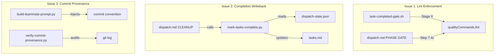

# Design: quality-gates-v2

## Overview

Three targeted script-level fixes to the ralph-parallel plugin. Each fix follows the existing pattern: deterministic logic in scripts, dispatch.md as thin orchestration glue. No new hooks; all changes are additive to existing files or new standalone scripts.

## Architecture



## Components

### Component A: Lint Stage in task-completed-gate.sh
**Purpose**: Block task completion when lint command fails
**Responsibilities**:
- Read `qualityCommands.lint` from dispatch-state.json
- Run lint command periodically (every LINT_INTERVAL tasks, default 3)
- On failure: exit 2 with last 30 lines of output
- On missing command: no-op (exit 0)

**Implementation**: New Stage 6 block after existing Stage 5 (test regression). Follows exact same pattern as Stage 4 (periodic build) -- read command from dispatch-state, check interval, run, report.

### Component B: mark-tasks-complete.py
**Purpose**: Update tasks.md checkboxes from dispatch completion state
**Responsibilities**:
- Read dispatch-state.json to get completedGroups and groups (with task IDs per group)
- For each completed group, collect its task IDs
- Read tasks.md, find matching `- [ ] X.Y` lines, replace with `- [x] X.Y`
- Write updated tasks.md back
- Report count of tasks marked

**Interface**:
```
python3 mark-tasks-complete.py \
  --dispatch-state specs/$specName/.dispatch-state.json \
  --tasks-md specs/$specName/tasks.md
```

**Output**: JSON to stdout: `{"marked": 5, "alreadyComplete": 2, "notFound": 0}`

### Component C: Commit Provenance in build-teammate-prompt.py
**Purpose**: Inject commit attribution convention into teammate prompts
**Responsibilities**:
- Add a "Commit Convention" section to generated prompts
- Require `Signed-off-by: <group-name>` trailer on every commit
- Provide example commit message in the prompt

### Component D: verify-commit-provenance.py
**Purpose**: Post-merge audit of commit provenance
**Responsibilities**:
- Read dispatch-state.json for group names and expected task IDs
- Scan git log for commits since dispatch start
- Check each commit for Signed-off-by trailer
- Report unattributed commits

**Interface**:
```
python3 verify-commit-provenance.py \
  --dispatch-state specs/$specName/.dispatch-state.json \
  [--since "2026-02-22T00:00:00Z"]
```

## Data Flow

1. **Lint enforcement**: TaskCompleted hook fires -> task-completed-gate.sh Stage 6 -> reads qualityCommands.lint from dispatch-state.json -> runs command -> blocks on failure
2. **Completion writeback**: Dispatch CLEANUP -> calls mark-tasks-complete.py -> reads completedGroups from dispatch-state.json -> maps to task IDs -> regex-replaces in tasks.md
3. **Commit provenance**: Teammate spawned -> build-teammate-prompt.py adds commit convention -> teammate commits with trailer -> verify-commit-provenance.py audits post-merge

## Technical Decisions

| Decision | Options | Choice | Rationale |
|----------|---------|--------|-----------|
| Lint frequency | Every task / Periodic / Phase gate only | Periodic (same as build) | Balance between catching errors early and not slowing dispatch |
| Provenance mechanism | Branch name / Commit trailer / Commit prefix tag | Git trailer (Signed-off-by) | Standard git convention, parseable by git log --format, works with all git tools |
| Writeback trigger | Per-task / Per-group / At cleanup | At cleanup | Simpler, avoids race conditions between concurrent teammates |
| Writeback script language | Bash / Python | Python | Regex replacement and JSON parsing are cleaner in Python, matches existing script patterns |

## File Structure

| File | Action | Purpose |
|------|--------|---------|
| `ralph-parallel/hooks/scripts/task-completed-gate.sh` | Modify | Add Stage 6: periodic lint check |
| `ralph-parallel/scripts/mark-tasks-complete.py` | Create | Read dispatch state, update tasks.md checkboxes |
| `ralph-parallel/scripts/build-teammate-prompt.py` | Modify | Add commit convention section with Signed-off-by trailer |
| `ralph-parallel/scripts/verify-commit-provenance.py` | Create | Post-merge commit provenance audit |
| `ralph-parallel/commands/dispatch.md` | Modify | Add lint to PHASE GATE, add mark-tasks-complete.py to CLEANUP |

## Error Handling

| Error | Handling | User Impact |
|-------|----------|-------------|
| qualityCommands.lint is null/empty | Skip lint stage silently | No impact -- project has no lint configured |
| Lint command exits non-zero | Exit 2, show last 30 lines stderr | Task blocked until lint fixed |
| dispatch-state.json missing completedGroups | mark-tasks-complete.py exits 0, marks nothing | Safe no-op |
| Task ID in completedGroups not found in tasks.md | Skip, increment notFound counter | Warning in output JSON |
| Commit missing Signed-off-by trailer | verify-commit-provenance.py reports as unattributed | Informational only (does not block) |

## Existing Patterns to Follow

- **task-completed-gate.sh Stage 4** (lines 179-198): Periodic build check pattern. Stage 6 lint is a direct copy with `BUILD_CMD` -> `LINT_CMD`, `BUILD_INTERVAL` -> `LINT_INTERVAL`
- **capture-baseline.sh**: Standalone script that reads dispatch-state.json via jq, processes data, writes back. mark-tasks-complete.py follows this input/output pattern
- **build-teammate-prompt.py build_quality_section()**: Existing quality section builder. Commit convention section follows same list-based string building pattern
- **parse-and-partition.py parse_tasks()**: Task regex `r'^- \[(.)\]\s*(\d+\.\d+)\s*(.*)'` is the canonical format. mark-tasks-complete.py reuses this regex
