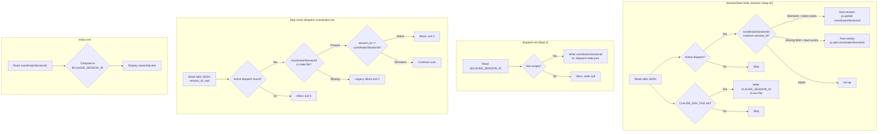
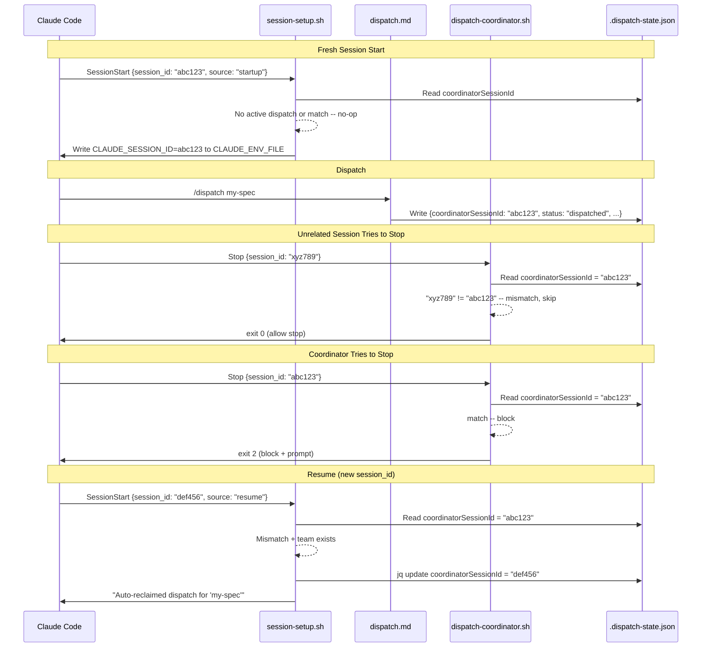

# Design: Session Isolation

## Overview

Add `coordinatorSessionId` to `.dispatch-state.json` so the Stop hook compares `session_id` from stdin against the stored coordinator, only blocking the owning session. Recovery from session ID changes (resume/restart) is handled by deterministic auto-reclaim in SessionStart, with CLAUDE_ENV_FILE as a best-effort bridge for fresh sessions.

## Architecture



## Data Flow



## Components

### 1. dispatch-coordinator.sh (Stop Hook)

**Purpose**: Block coordinator session from stopping during active dispatch. Allow unrelated sessions through.

**Interface** (stdin JSON, provided by Claude Code):
```json
{
  "session_id": "string",
  "stop_hook_active": true,
  "cwd": "/path/to/project",
  "last_assistant_message": "..."
}
```

**Critical design change: Multi-spec scan**

The current scan loop (lines 45-55) `break`s on the first active dispatch found. This is incorrect for session isolation: if Session A dispatches spec X and Session B dispatches spec Y, the scan might find spec Y first (alphabetical glob order), see a mismatch, and `exit 0` -- letting Session A stop while its own spec X dispatch is active.

Fix: the scan loop must check ALL active dispatches. If ANY has a matching `coordinatorSessionId`, block. If all active dispatches have mismatching coordinators, allow.

**New scan logic** (replaces lines 42-58):

```bash
  # No team context (session restart?) -- scan ALL active dispatches
  DISPATCH_STATE=""
  SPEC_NAME=""
  FOUND_ANY_ACTIVE=false
  FOUND_MY_DISPATCH=false

  for state_file in "$PROJECT_ROOT"/specs/*/.dispatch-state.json; do
    [ -f "$state_file" ] || continue
    FILE_STATUS=$(jq -r '.status // "unknown"' "$state_file" 2>/dev/null) || continue
    [ "$FILE_STATUS" = "dispatched" ] || continue

    FOUND_ANY_ACTIVE=true
    COORD_SID=$(jq -r '.coordinatorSessionId // empty' "$state_file" 2>/dev/null) || COORD_SID=""

    if [ -z "$COORD_SID" ]; then
      # Legacy dispatch (no coordinatorSessionId) -- block any session
      FOUND_MY_DISPATCH=true
      DISPATCH_STATE="$state_file"
      SPEC_NAME=$(basename "$(dirname "$state_file")")
      SPEC_DIR="$PROJECT_ROOT/specs/$SPEC_NAME"
      break
    elif [ -z "$SESSION_ID" ]; then
      # Empty session_id in input -- treat as legacy (block)
      FOUND_MY_DISPATCH=true
      DISPATCH_STATE="$state_file"
      SPEC_NAME=$(basename "$(dirname "$state_file")")
      SPEC_DIR="$PROJECT_ROOT/specs/$SPEC_NAME"
      break
    elif [ "$COORD_SID" = "$SESSION_ID" ]; then
      # This session owns this dispatch -- block
      FOUND_MY_DISPATCH=true
      DISPATCH_STATE="$state_file"
      SPEC_NAME=$(basename "$(dirname "$state_file")")
      SPEC_DIR="$PROJECT_ROOT/specs/$SPEC_NAME"
      break
    fi
    # Mismatch -- continue scanning other specs
  done

  if [ "$FOUND_MY_DISPATCH" = false ]; then
    # No active dispatch belongs to this session (or no active dispatches at all)
    exit 0
  fi
```

**Team-name branch** (lines 36-40): When `TEAM_NAME` is set, the spec is known. Session comparison happens AFTER resolving `DISPATCH_STATE`, in the unified comparison block.

**Unified session comparison block** (insert after line 59, before line 61):

For the team-name branch only (scan branch already handles comparison inline):

```bash
# --- Session isolation (team-name branch) ---
if [ -n "$TEAM_NAME" ] && [ -f "$DISPATCH_STATE" ]; then
  COORD_SID=$(jq -r '.coordinatorSessionId // empty' "$DISPATCH_STATE" 2>/dev/null) || COORD_SID=""
  if [ -n "$COORD_SID" ] && [ -n "$SESSION_ID" ]; then
    if [ "$COORD_SID" != "$SESSION_ID" ]; then
      exit 0
    fi
  fi
  # Missing COORD_SID or empty SESSION_ID: legacy (block)
fi
```

**SESSION_ID extraction** (new line after line 17):
```bash
SESSION_ID=$(echo "$INPUT" | jq -r '.session_id // empty' 2>/dev/null) || SESSION_ID=""
```

### 2. session-setup.sh (SessionStart Hook)

**Purpose**: Auto-reclaim orphaned dispatches, export CLAUDE_SESSION_ID, existing gc.auto and context output.

**Current behavior**: Does NOT read stdin JSON. Scans for active dispatches, manages gc.auto, outputs context.

**New behavior**: Read stdin, extract session_id, auto-reclaim/stamp, export via CLAUDE_ENV_FILE.

**A. Stdin parsing (insert BEFORE line 13, before GIT_ROOT)**:

```bash
# Read hook input (must be first -- stdin is consumed once)
INPUT=$(cat)
SESSION_ID=$(echo "$INPUT" | jq -r '.session_id // empty' 2>/dev/null) || SESSION_ID=""
```

**B. CLAUDE_ENV_FILE export (insert after stdin parsing)**:

```bash
# Best-effort: export session_id for dispatch.md to read
# Works on fresh start, broken on resume (#24775) -- auto-reclaim compensates
if [ -n "${CLAUDE_ENV_FILE:-}" ] && [ -n "$SESSION_ID" ]; then
  echo "CLAUDE_SESSION_ID=$SESSION_ID" >> "$CLAUDE_ENV_FILE" 2>/dev/null || true
fi
```

**C. Auto-reclaim (insert after TEAM_EXISTS check at current line 77, before context output at line 79)**:

```bash
  # Auto-reclaim: update coordinatorSessionId when session changes
  if [ -n "$SESSION_ID" ]; then
    COORD_SID=$(jq -r '.coordinatorSessionId // empty' "$DISPATCH_FILE" 2>/dev/null) || COORD_SID=""

    if [ -n "$COORD_SID" ] && [ "$COORD_SID" != "$SESSION_ID" ] && [ "$TEAM_EXISTS" = true ]; then
      # Session changed (resume/restart) + team active = auto-reclaim
      jq --arg sid "$SESSION_ID" '.coordinatorSessionId = $sid' "$DISPATCH_FILE" > "${DISPATCH_FILE}.tmp" \
        && mv "${DISPATCH_FILE}.tmp" "$DISPATCH_FILE"
      echo "ralph-parallel: Auto-reclaimed dispatch for '$ACTIVE_SPEC' (session changed)"
    elif [ -z "$COORD_SID" ] && [ "$TEAM_EXISTS" = true ]; then
      # Legacy dispatch (no field) -- stamp current session
      jq --arg sid "$SESSION_ID" '.coordinatorSessionId = $sid' "$DISPATCH_FILE" > "${DISPATCH_FILE}.tmp" \
        && mv "${DISPATCH_FILE}.tmp" "$DISPATCH_FILE"
      echo "ralph-parallel: Stamped session ID on legacy dispatch for '$ACTIVE_SPEC'"
    fi
  fi
```

**Guard conditions**:
- `TEAM_EXISTS = true`: Active teammates mean a real coordinator is needed. Team-lost + mismatch = user must decide (re-dispatch).
- `SESSION_ID` non-empty: Can't stamp without valid session_id.
- `COORD_SID != SESSION_ID`: Only update on mismatch (no-op if already correct).

**Variable scoping**: `DISPATCH_FILE` is already defined at current line 62 inside the `if [ "$DISPATCH_ACTIVE" = true ]` block. The auto-reclaim block is placed inside that same conditional, so `DISPATCH_FILE` is in scope.

### 3. dispatch.md (Dispatch Skill)

**Purpose**: Write coordinatorSessionId during dispatch, add --reclaim flag.

**A. Step 4 change** -- add coordinatorSessionId to the state object:

Current Step 4 writes:
```json
{
  "dispatchedAt": "<ISO timestamp>",
  "strategy": "$strategy",
  "maxTeammates": $maxTeammates,
  "groups": "...",
  "serialTasks": "...",
  "verifyTasks": "...",
  "qualityCommands": "...",
  "baselineSnapshot": null,
  "status": "dispatched",
  "completedGroups": []
}
```

New Step 4 writes:
```json
{
  "dispatchedAt": "<ISO timestamp>",
  "coordinatorSessionId": "$CLAUDE_SESSION_ID or null",
  "strategy": "$strategy",
  "maxTeammates": $maxTeammates,
  "groups": "...",
  "serialTasks": "...",
  "verifyTasks": "...",
  "qualityCommands": "...",
  "baselineSnapshot": null,
  "status": "dispatched",
  "completedGroups": []
}
```

If `$CLAUDE_SESSION_ID` is empty/unset: write `"coordinatorSessionId": null` and log: `"Warning: Session ID unavailable -- will be set by auto-reclaim on next session start."`

**B. Argument parsing** -- add `--reclaim`:

```text
- **--reclaim**: Reclaim coordinator ownership for this session

If `--reclaim`: skip to Reclaim Handler section below.
```

**C. Reclaim Handler** (new section after Abort Handler):

```text
## Reclaim Handler

When `--reclaim` flag is present:

1. Resolve spec (same as Step 1)
2. Read specs/$specName/.dispatch-state.json
   - If missing: "No dispatch state found for '$specName'."
   - If status != "dispatched": "No active dispatch to reclaim (status: $status)."
3. Read $CLAUDE_SESSION_ID env var
   - If empty: "Session ID unavailable. Restart Claude to get a fresh session ID."
4. Update via jq:
   jq --arg sid "$CLAUDE_SESSION_ID" '.coordinatorSessionId = $sid' state.json > tmp && mv tmp state.json
5. Output: "Reclaimed dispatch for '$specName' -- this session is now coordinator."
```

### 4. status.md (Status Skill)

**Purpose**: Show coordinator ownership line.

**Step 1 addition** -- after loading dispatch state:
```text
5. Read coordinatorSessionId from dispatch state
6. Compare against $CLAUDE_SESSION_ID env var:
   - Both present + match: isCoordinator = true, display "Coordinator: this session"
   - Both present + mismatch: isCoordinator = false, display "Coordinator: different session"
   - coordinatorSessionId missing/null: isCoordinator = null, display "Coordinator: unknown (legacy)"
   - $CLAUDE_SESSION_ID empty: isCoordinator = null, display "Coordinator: unknown (env unavailable)"
```

**Step 3 display** -- add line after "Strategy:" line:
```text
Strategy: $strategy | Dispatched: $timestamp
Coordinator: this session | different session | unknown (legacy)
```

**JSON output** -- add fields:
```json
{
  "...existing...",
  "coordinatorSessionId": "<value or null>",
  "isCoordinator": true | false | null
}
```

## Technical Decisions

| Decision | Options Considered | Choice | Rationale |
|----------|-------------------|--------|-----------|
| Scan loop strategy | Break on first match vs scan all | Scan all active dispatches | Break-on-first is incorrect: Session A dispatching spec X could be let through if spec Y (different coordinator) sorts first alphabetically. Must check all. |
| Session comparison in scan branch | After scan vs unified block | Inline in scan loop | Comparison must happen per-spec-file since multiple dispatches may be active. Can't defer to a single block after the loop. |
| Session comparison in team-name branch | Inline vs unified block | Separate block after line 59 | Team-name branch resolves one specific spec. Single comparison suffices. |
| Legacy fallback | Block vs allow | Block any session | Backward compat. Existing behavior preserved for dispatches without coordinatorSessionId. (AC-1.4, FR-9) |
| Empty session_id handling | Block vs allow vs warn | Block (treat as legacy) | Safe default. If Claude Code stops sending session_id, we don't accidentally allow stops. (T-5) |
| Auto-reclaim guard | Always vs team-exists-only | Team-exists-only | Stale dispatch with no team = no coordinator needed. Prevents hijacking unrelated sessions. (AC-3.4, FR-10) |
| CLAUDE_ENV_FILE strategy | Sole mechanism vs best-effort bridge | Best-effort bridge | #24775 makes it unreliable on resume. Auto-reclaim is the reliable path. (AC-4.3) |
| State file writes | In-place vs temp+mv | temp+mv (jq > tmp && mv) | Atomic. No partial writes on crash. (NFR-4) |
| --reclaim implementation | Separate script vs dispatch.md section | dispatch.md section | Thin wrapper around jq update. Same code path as auto-reclaim. No new script needed. |
| coordinatorSessionId when env empty | Omit field vs write null | Write null | Explicit. Distinguishes "dispatch ran without session_id" from "legacy dispatch pre-feature". (AC-2.3) |

## File Structure

| File | Action | Purpose |
|------|--------|---------|
| `ralph-parallel/hooks/scripts/dispatch-coordinator.sh` | Modify | SESSION_ID extraction, multi-spec scan with session comparison, team-name branch comparison |
| `ralph-parallel/hooks/scripts/session-setup.sh` | Modify | Stdin parsing, CLAUDE_ENV_FILE export, auto-reclaim block |
| `ralph-parallel/commands/dispatch.md` | Modify | coordinatorSessionId in Step 4 schema, --reclaim flag + handler |
| `ralph-parallel/commands/status.md` | Modify | Coordinator ownership display in Step 3 + JSON output |
| `ralph-parallel/scripts/test_session_isolation.sh` | Create | Unit, integration, and edge case tests for session isolation |

## Detailed Code Changes

### dispatch-coordinator.sh -- Full Modified Structure

```
Lines  1-14:  [unchanged] Header, set -euo pipefail
Line  15-16:  [unchanged] INPUT=$(cat), CWD extraction
Line  17:     [NEW] SESSION_ID=$(echo "$INPUT" | jq -r '.session_id // empty' 2>/dev/null) || SESSION_ID=""
Lines 18-31:  [unchanged] PROJECT_ROOT, agent name check
Lines 32-40:  [unchanged] TEAM_NAME check, derive spec from team
Lines 41-76:  [REWRITTEN] Multi-spec scan with inline session comparison
Lines 77-85:  [NEW] Team-name branch session comparison
Lines 86+:    [unchanged] File existence check, status check, completion check, blocking logic
```

**Lines 41-76 (replaces current lines 41-58) -- scan branch rewrite**:

```bash
else
  # No team context (session restart?) -- scan ALL active dispatches
  DISPATCH_STATE=""
  SPEC_NAME=""
  FOUND_ANY_ACTIVE=false
  FOUND_MY_DISPATCH=false

  for state_file in "$PROJECT_ROOT"/specs/*/.dispatch-state.json; do
    [ -f "$state_file" ] || continue
    FILE_STATUS=$(jq -r '.status // "unknown"' "$state_file" 2>/dev/null) || continue
    [ "$FILE_STATUS" = "dispatched" ] || continue

    FOUND_ANY_ACTIVE=true
    COORD_SID=$(jq -r '.coordinatorSessionId // empty' "$state_file" 2>/dev/null) || COORD_SID=""

    if [ -z "$COORD_SID" ]; then
      # Legacy dispatch (no coordinatorSessionId) -- block any session
      FOUND_MY_DISPATCH=true
      DISPATCH_STATE="$state_file"
      SPEC_NAME=$(basename "$(dirname "$state_file")")
      SPEC_DIR="$PROJECT_ROOT/specs/$SPEC_NAME"
      break
    elif [ -z "$SESSION_ID" ]; then
      # Empty session_id in input -- treat as legacy (block)
      FOUND_MY_DISPATCH=true
      DISPATCH_STATE="$state_file"
      SPEC_NAME=$(basename "$(dirname "$state_file")")
      SPEC_DIR="$PROJECT_ROOT/specs/$SPEC_NAME"
      break
    elif [ "$COORD_SID" = "$SESSION_ID" ]; then
      # This session owns this dispatch -- block
      FOUND_MY_DISPATCH=true
      DISPATCH_STATE="$state_file"
      SPEC_NAME=$(basename "$(dirname "$state_file")")
      SPEC_DIR="$PROJECT_ROOT/specs/$SPEC_NAME"
      break
    fi
    # Mismatch -- continue scanning other specs
  done

  if [ "$FOUND_MY_DISPATCH" = false ]; then
    exit 0
  fi
fi
```

**Lines 77-85 (new, after the `fi` closing the if/else) -- team-name branch session check**:

```bash
# --- Session isolation (team-name branch) ---
if [ -n "$TEAM_NAME" ] && [ -f "$DISPATCH_STATE" ]; then
  COORD_SID=$(jq -r '.coordinatorSessionId // empty' "$DISPATCH_STATE" 2>/dev/null) || COORD_SID=""
  if [ -n "$COORD_SID" ] && [ -n "$SESSION_ID" ]; then
    if [ "$COORD_SID" != "$SESSION_ID" ]; then
      exit 0
    fi
  fi
  # Missing COORD_SID or empty SESSION_ID: legacy behavior (block)
fi
```

### session-setup.sh -- Full Modified Structure

```
Lines  1-9:   [unchanged] Header comments
Lines 10-12:  [NEW] INPUT=$(cat), SESSION_ID extraction
Lines 13-16:  [NEW] CLAUDE_ENV_FILE export
Lines 17+:    [renumbered, unchanged] GIT_ROOT, worktree check, dispatch scan, gc.auto
...inside DISPATCH_ACTIVE block, after TEAM_EXISTS check:
Lines XX-YY:  [NEW] Auto-reclaim block
...rest:      [unchanged] Context output, exit 0
```

**New lines 10-16** (insert BEFORE the existing `GIT_ROOT=$(git rev-parse ...)` line):

```bash
# Read hook input (must be first -- stdin is consumed once)
INPUT=$(cat)
SESSION_ID=$(echo "$INPUT" | jq -r '.session_id // empty' 2>/dev/null) || SESSION_ID=""

# Best-effort: export session_id for dispatch.md to read
# Works on fresh start, broken on resume (#24775) -- auto-reclaim compensates
if [ -n "${CLAUDE_ENV_FILE:-}" ] && [ -n "$SESSION_ID" ]; then
  echo "CLAUDE_SESSION_ID=$SESSION_ID" >> "$CLAUDE_ENV_FILE" 2>/dev/null || true
fi
```

**Auto-reclaim block** (insert after current line 77, before line 79's context output):

```bash
  # Auto-reclaim: update coordinatorSessionId when session changes
  if [ -n "$SESSION_ID" ]; then
    COORD_SID=$(jq -r '.coordinatorSessionId // empty' "$DISPATCH_FILE" 2>/dev/null) || COORD_SID=""

    if [ -n "$COORD_SID" ] && [ "$COORD_SID" != "$SESSION_ID" ] && [ "$TEAM_EXISTS" = true ]; then
      # Session changed (resume/restart) + team active = auto-reclaim
      jq --arg sid "$SESSION_ID" '.coordinatorSessionId = $sid' "$DISPATCH_FILE" > "${DISPATCH_FILE}.tmp" \
        && mv "${DISPATCH_FILE}.tmp" "$DISPATCH_FILE"
      echo "ralph-parallel: Auto-reclaimed dispatch for '$ACTIVE_SPEC' (session changed)"
    elif [ -z "$COORD_SID" ] && [ "$TEAM_EXISTS" = true ]; then
      # Legacy dispatch (no field) -- stamp current session
      jq --arg sid "$SESSION_ID" '.coordinatorSessionId = $sid' "$DISPATCH_FILE" > "${DISPATCH_FILE}.tmp" \
        && mv "${DISPATCH_FILE}.tmp" "$DISPATCH_FILE"
      echo "ralph-parallel: Stamped session ID on legacy dispatch for '$ACTIVE_SPEC'"
    fi
  fi
```

### dispatch.md -- Changes

**Argument parsing** -- add one line:
```text
- **--reclaim**: Reclaim coordinator ownership for this session

If `--reclaim`: skip to Reclaim Handler section below.
```

**Step 4** -- add `coordinatorSessionId` to schema:
```text
   {
     "dispatchedAt": "<ISO timestamp>",
     "coordinatorSessionId": "$CLAUDE_SESSION_ID or null",
     "strategy": "$strategy",
     ...rest unchanged...
   }

   If $CLAUDE_SESSION_ID is empty/unset: write "coordinatorSessionId": null
   and log: "Warning: Session ID unavailable -- will be set by auto-reclaim."
```

**New section** (after Abort Handler):
```text
## Reclaim Handler

When `--reclaim` flag is present:

1. Resolve spec (same as Step 1)
2. Read specs/$specName/.dispatch-state.json
   - If missing: "No dispatch state found for '$specName'."
   - If status != "dispatched": "No active dispatch to reclaim (status: $status)."
3. Read $CLAUDE_SESSION_ID env var
   - If empty: "Session ID unavailable. Restart Claude to get a fresh session ID."
4. jq --arg sid "$CLAUDE_SESSION_ID" '.coordinatorSessionId = $sid' "$stateFile" > tmp && mv tmp "$stateFile"
5. Output: "Reclaimed dispatch for '$specName' -- this session is now coordinator."
```

### status.md -- Changes

**Step 1** -- add after loading dispatch state:
```text
5. Read coordinatorSessionId from dispatch state
6. Compare against $CLAUDE_SESSION_ID env var:
   - Both present + match: isCoordinator = true, "Coordinator: this session"
   - Both present + mismatch: isCoordinator = false, "Coordinator: different session"
   - coordinatorSessionId missing/null: isCoordinator = null, "Coordinator: unknown (legacy)"
   - $CLAUDE_SESSION_ID empty: isCoordinator = null, "Coordinator: unknown (env unavailable)"
```

**Step 3 display format**:
```text
Strategy: $strategy | Dispatched: $timestamp
Coordinator: this session
```

**JSON output fields**:
```json
{
  "coordinatorSessionId": "<value or null>",
  "isCoordinator": true | false | null
}
```

## Error Handling

| Error Scenario | Handling Strategy | User Impact |
|----------------|-------------------|-------------|
| Corrupted .dispatch-state.json | jq fails, `\|\| COORD_SID=""` catches it, falls through to legacy block | Stop hook blocks (safe default). No crash. |
| session_id missing from stdin JSON | `SESSION_ID=""`, treated as legacy | Block any session (backward compat). |
| CLAUDE_ENV_FILE points to nonexistent dir | `>> "$CLAUDE_ENV_FILE" 2>/dev/null \|\| true` | Silent skip. Auto-reclaim handles it. |
| CLAUDE_ENV_FILE empty/unset | `${CLAUDE_ENV_FILE:-}` check skips export | No error. |
| jq not on PATH | `set -euo pipefail` + `\|\| exit 0` / `\|\| VAR=""` | Hooks exit 0 (allow stop). Existing behavior. |
| Concurrent session starts (TOCTOU) | Last writer wins via temp+mv | Correct: last session to start IS the coordinator. |
| Auto-reclaim temp file write fails | `&& mv` ensures atomic -- if jq fails, mv never runs | State file unchanged. Next SessionStart retries. |
| Two specs dispatched by different sessions | Scan loop iterates all specs, only blocks on match/legacy | Each session blocked only by its own dispatch. |

## Edge Cases

- **Two specs dispatched, different coordinators**: Scan loop continues past mismatches. Session A owning spec X is blocked by spec X (match), not by spec Y (mismatch, skipped). Session B owning spec Y is blocked by spec Y, not spec X.
- **Legacy file + fresh session**: coordinatorSessionId missing. Scan loop hits the `[ -z "$COORD_SID" ]` branch and blocks (legacy). SessionStart stamps it if team exists.
- **Corrupted JSON**: jq returns empty string via `|| COORD_SID=""`. Falls through to legacy block. Safe.
- **Empty session_id in hook input**: Scan loop hits `[ -z "$SESSION_ID" ]` branch and blocks (legacy). Safe default.
- **Team config exists but 0 members**: TEAM_EXISTS=false. Auto-reclaim skipped. Stop hook still blocks via legacy path.
- **Multiple active dispatches, one legacy + one session-aware**: Legacy dispatch blocks any session (break immediately in scan loop). This is correct -- legacy dispatches should block conservatively.
- **Session A dispatches, resumes as A'**: SessionStart auto-reclaims (mismatch + team exists). A' is now coordinator. Stop hook blocks A', allows other sessions.
- **--reclaim from new terminal**: CLAUDE_SESSION_ID set by SessionStart's CLAUDE_ENV_FILE export (fresh session, so it works). Reclaim updates coordinatorSessionId.

## Test Strategy

### Test Harness

Bash test script at `ralph-parallel/scripts/test_session_isolation.sh`. Each test:
1. Creates temp dir with mock specs/state files/team configs
2. Pipes JSON to script stdin
3. Asserts exit code and/or file contents
4. Cleans up temp dir

Helper functions:
```bash
setup_project() {
  TMPDIR=$(mktemp -d)
  mkdir -p "$TMPDIR/specs/test-spec"
  # Returns TMPDIR
}

write_dispatch_state() {
  # $1 = dir, $2 = coordinatorSessionId (or empty for legacy), $3 = status
  local coord_field=""
  if [ -n "$2" ]; then
    coord_field="\"coordinatorSessionId\": \"$2\","
  fi
  cat > "$1/specs/test-spec/.dispatch-state.json" <<JSON
{
  ${coord_field}
  "status": "${3:-dispatched}",
  "groups": [{"name": "g1"}],
  "completedGroups": []
}
JSON
}

write_team_config() {
  # $1 = spec name, $2 = member count
  local dir="$HOME/.claude/teams/${1}-parallel"
  mkdir -p "$dir"
  if [ "$2" -gt 0 ]; then
    echo '{"members":[{"name":"t1"}]}' > "$dir/config.json"
  else
    echo '{"members":[]}' > "$dir/config.json"
  fi
}

assert_exit_code() {
  if [ "$1" -ne "$2" ]; then
    echo "FAIL: expected exit $2, got $1" >&2
    FAILURES=$((FAILURES + 1))
  else
    PASSES=$((PASSES + 1))
  fi
}

assert_file_contains() {
  if grep -q "$2" "$1" 2>/dev/null; then
    PASSES=$((PASSES + 1))
  else
    echo "FAIL: $1 does not contain '$2'" >&2
    FAILURES=$((FAILURES + 1))
  fi
}
```

### Unit Tests (dispatch-coordinator.sh)

| Test ID | Setup | Input session_id | Expected Exit | Validates |
|---------|-------|-----------------|---------------|-----------|
| T-1 | coord=sess-A, status=dispatched | sess-A | 2 (block) | AC-1.2: matching session blocked |
| T-2 | coord=sess-A, status=dispatched | sess-B | 0 (allow) | AC-1.1: mismatching session allowed |
| T-3 | no coordinatorSessionId, status=dispatched | sess-B | 2 (block) | AC-1.4: legacy fallback blocks |
| T-4 | coord=sess-A, status=merged | sess-A | 0 (allow) | Non-active dispatch allows stop |
| T-5 | coord=sess-A, status=dispatched | "" (empty) | 2 (block) | Empty session_id = legacy block |

### Unit Tests (session-setup.sh)

| Test ID | Setup | Input session_id | Team Exists | Expected | Validates |
|---------|-------|-----------------|-------------|----------|-----------|
| T-6 | coord=sess-A | sess-B | yes | coord updated to sess-B | AC-3.2: auto-reclaim |
| T-7 | coord=sess-A | sess-B | no | coord unchanged (sess-A) | AC-3.4: team guard |
| T-8 | no coord field | sess-B | yes | coord stamped as sess-B | AC-3.3: legacy stamp |
| T-9 | no coord field | sess-B | no | no coord field added | AC-3.4: team guard |
| T-10 | CLAUDE_ENV_FILE=tmpfile | sess-B | n/a | file contains CLAUDE_SESSION_ID=sess-B | AC-4.1 |
| T-11 | CLAUDE_ENV_FILE unset | sess-B | n/a | no error, no file | AC-4.2 |
| T-12 | coord=sess-A | sess-A | yes | coord unchanged (sess-A) | No-op on match |

### Integration Tests

| Test ID | Scenario | How to Simulate | Expected |
|---------|----------|-----------------|----------|
| IT-1 | Session A dispatches, Session B stops | State with coord=A, pipe session_id=B to Stop hook | exit 0 |
| IT-2 | Resume auto-reclaim | State with coord=old, pipe session_id=new to SessionStart with team config | coord updated |
| IT-3 | /status ownership | State with coord, check display output | "this session" or "different session" |
| IT-4 | Legacy dispatch blocks all | State without coord, any session_id to Stop hook | exit 2 |
| IT-5 | --reclaim updates coord | Active dispatch, run reclaim jq command | coord updated, confirmation shown |

### Edge Case Tests

| Test ID | Scenario | How to Simulate | Expected |
|---------|----------|-----------------|----------|
| EC-1 | Two specs, different coordinators | Two state files: spec-A coord=A, spec-B coord=B. Pipe session_id=A | Block (spec-A match). Pipe session_id=C -> allow (no match). |
| EC-2 | Corrupted JSON | Write `{invalid` to state file | exit 0 (jq fails gracefully) |
| EC-3 | CLAUDE_ENV_FILE bad path | Set CLAUDE_ENV_FILE=/nonexistent/path | No error from session-setup.sh |
| EC-4 | Team config 0 members | Create team config with empty members array | Auto-reclaim skipped |
| EC-5 | Concurrent starts | Run SessionStart twice, each with different session_id | Last writer's session_id persists |

### Test File Location

```
ralph-parallel/scripts/test_session_isolation.sh
```

Run: `bash ralph-parallel/scripts/test_session_isolation.sh`

Regression check: `python3 ralph-parallel/scripts/test_parse_and_partition.py && python3 ralph-parallel/scripts/test_build_teammate_prompt.py && python3 ralph-parallel/scripts/test_mark_tasks_complete.py && python3 ralph-parallel/scripts/test_verify_commit_provenance.py`

## Performance Considerations

- Session_id comparison adds ONE `jq -r` call per active dispatch in scan loop (~10ms each). Worst case: N active dispatches = N x 10ms. Typical: 1 dispatch = 10ms. Well within NFR-1 target (50ms).
- Auto-reclaim adds ONE `jq` read + conditional `jq` write to SessionStart (~20ms). Within NFR-2 target (100ms).
- CLAUDE_ENV_FILE write is a single `echo >>` (~1ms).
- Multi-spec scan adds jq calls per spec but only for `status=dispatched` files (typically 0-1 active).

## Security Considerations

- Session IDs are opaque strings from Claude Code. No secrets stored.
- State file is in project directory (already accessible to all sessions).
- No new file permissions needed.
- temp+mv pattern prevents partial writes.

## Existing Patterns to Follow

Based on codebase analysis:
- **jq error handling**: `$(jq ... 2>/dev/null) || VAR=""` -- used consistently in both hooks
- **Atomic writes**: `jq ... > file.tmp && mv file.tmp file` -- recommended in research
- **Stdin reading**: `INPUT=$(cat)` then `echo "$INPUT" | jq -r '...'` -- used in dispatch-coordinator.sh
- **Exit code semantics**: 0=allow, 2=block -- established in dispatch-coordinator.sh
- **Diagnostic messages**: `echo "ralph-parallel: ..."` -- prefix used in session-setup.sh
- **Team config path**: `$HOME/.claude/teams/${SPEC_NAME}-parallel/config.json` -- used in both hooks
- **TEAM_EXISTS check**: File exists + member count > 0 -- pattern from session-setup.sh lines 70-77

## Unresolved Questions

None. All questions from requirements phase are resolved:
- `--reclaim` executes immediately (no confirmation prompt)
- Empty `CLAUDE_SESSION_ID` at dispatch time: continue with null + warning (auto-reclaim handles recovery)
- Auto-reclaim fires on all `source` values (startup, resume, compact, clear) -- session_id may change on any restart

## Implementation Steps

1. **Modify `session-setup.sh`**: Add stdin parsing (`INPUT=$(cat)`, `SESSION_ID` extraction) at top of file, CLAUDE_ENV_FILE export, and auto-reclaim block after TEAM_EXISTS check
2. **Modify `dispatch-coordinator.sh`**: Add `SESSION_ID` extraction after `CWD` line, rewrite scan branch for multi-spec session comparison, add team-name branch session check
3. **Modify `dispatch.md`**: Add `coordinatorSessionId` to Step 4 state schema, add `--reclaim` to argument parsing, add Reclaim Handler section
4. **Modify `status.md`**: Add coordinator ownership display to Step 3 + JSON output fields
5. **Create `test_session_isolation.sh`**: Unit tests T-1 through T-12, integration tests IT-1 through IT-5, edge case tests EC-1 through EC-5
6. **Run existing tests**: Verify zero regressions in `python3 ralph-parallel/scripts/test_*.py`
7. **Manual smoke test**: Start two sessions, dispatch from one, verify the other can stop freely
